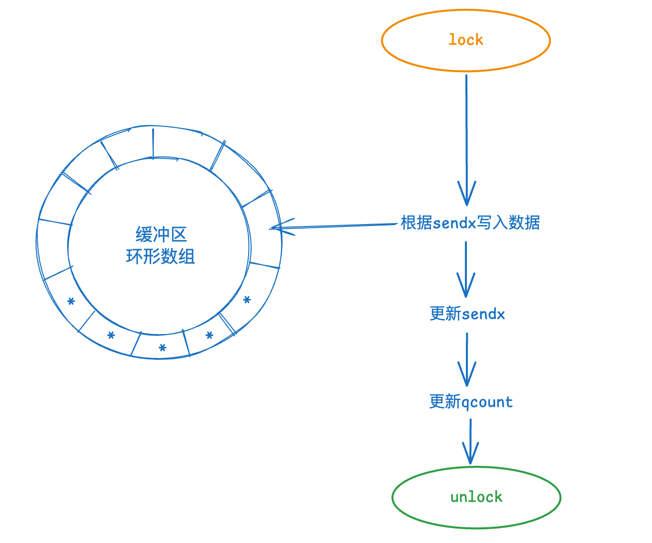
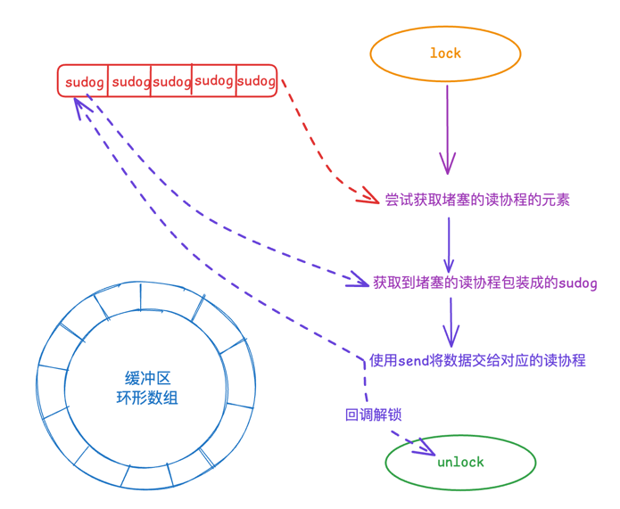
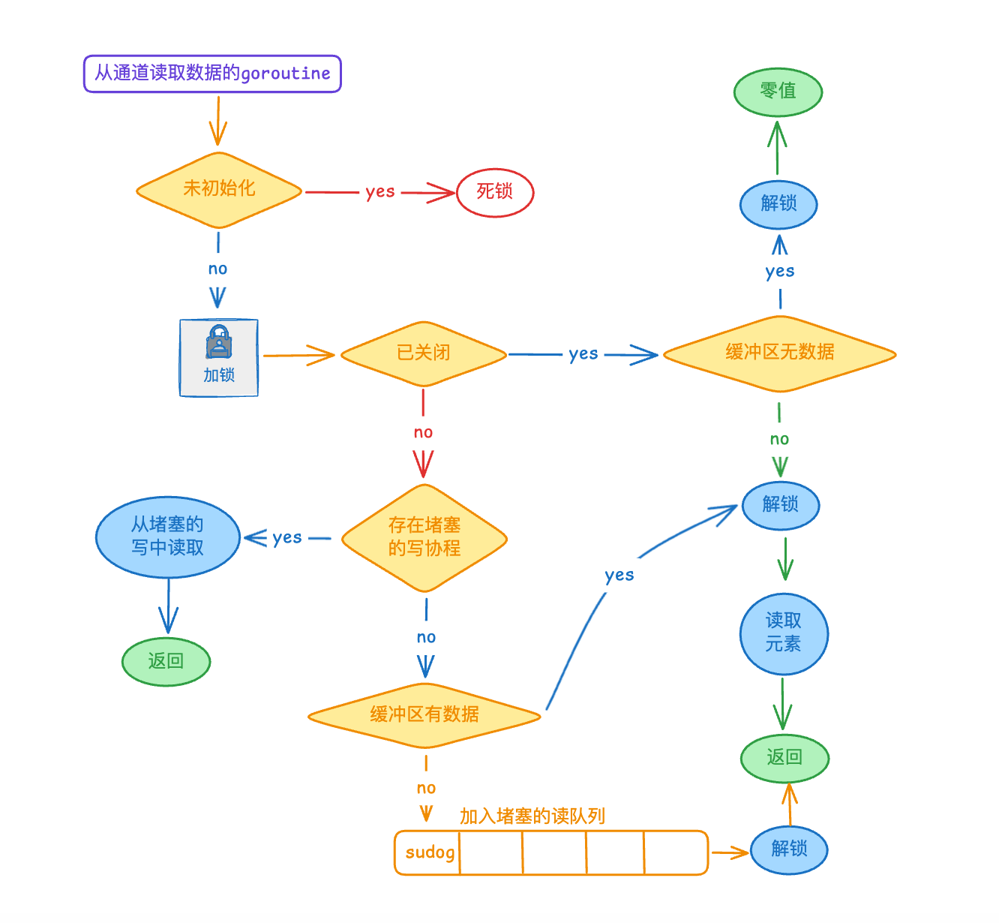

 ---
title: Golang中的channel
date: 2024-11-10
authors:
- name: Idris
  link: https://github.com/supuwoerc
  excludeSearch: true
  tags:
- Golang
- 基础
---

在 Go 语言中，channel（通道）是一种用于在 Goroutine 之间进行通信和同步的机制，本文介绍 Golang 中 channel 的实现原理和常见的使用场景。

<!--more-->
## 特点 & 作用
使用通道的场景一般是多协程处理任务的时候在协程之间传递信号，它的特点和作用如下：

1. 数据传递：channel 允许一个 Goroutine 向另一个 Goroutine 发送数据。

2. 同步机制：可以用于协调 Goroutine 的执行顺序，确保某些操作按照特定的顺序进行。

3. 阻塞特性：当向一个已满的 channel 发送数据或者从一个空的 channel 接收数据时，当前 Goroutine 会被阻塞，直到条件满足。

4. 有缓冲和无缓冲：可以创建有缓冲的 channel（指定缓冲区大小）和无缓冲的 channel。无缓冲的 channel 发送和接收操作会立即阻塞，直到配对的操作完成；有缓冲的 channel 在缓冲区未满或非空时不会阻塞。

## 快速入门
下面介绍通道的常见使用方法，包含创建，发送和接收数据，关闭以及遍历的两种方式。

### 创建
```go
// 无缓冲通道
ch1 := make(chan int)
// 有缓冲通道，缓冲区大小为 5
ch2 := make(chan int, 5)
```
### 发送和接收
```go
ch <- value  // 发送数据
value := <-ch  // 接收数据
```
### 关闭
```go
close(ch)
```
### 遍历
可以使用 range 遍历通道，这种方式会自动判断通道是否已经关闭完成
```go
    for result := range intChan {
        t.Log(result)
    }
```
还可以使用 for 循环来遍历，这种需要自己判断通道关闭来退出循环：
```go		
    for {
      result, ok := <-intChan
      // ok 在通道关闭且数据读取完后变为false
      if !ok {
          break
      }
      fmt.Println(result)
	}
```

### 两个协程通信的示例
```go
func TestChannel(t *testing.T) {
	group := sync.WaitGroup{}
	group.Add(2)
	intChan := make(chan int, 10)
	go func() {
		defer group.Done()
		for i := 0; i < 15; i++ {
			intChan <- i + 1
			time.Sleep(time.Millisecond * 1)
		}
		close(intChan)
	}()
	go func() {
		defer group.Done()
		for result := range intChan {
			t.Log(result)
		}
	}()
	group.Wait()
}
```

## 底层数据结构
源码位置：`golang.org/toolchain%40v0.0.1-go1.22.8.darwin-arm64/src/chan.go`

结构体字段：
```go
type hchan struct {
	qcount   uint           // 当前通道中存在的数据个数
	dataqsiz uint           // 环形数组的容量，即数组长度
	buf      unsafe.Pointer 
	elemsize uint16  // 元素的大小
	closed   uint32 // 是否已经关闭的标志位
	elemtype *_type // 元素的类型
	sendx    uint   // 填入数据的索引
	recvx    uint   // 取出数据的索引
	recvq    waitq  // 取出数据堵塞的协程队列
	sendq    waitq  // 发送数据堵塞的协程队列
	lock mutex
}
```
关于堵塞的协程队列的元素：
```go
type waitq struct {
  first *sudog // 队列的头
  last  *sudog // 队列的尾
}
```
关于协程队列中的元素类型：
```go
type sudog struct {
  g *g  // 协程实例指针
  next *sudog // 前一个节点
  prev *sudog // 后一个节点
  // some props
  isSelect bool // 标志位，标注当前的通道操作是不是在多路复用（select）中
  // some props
  c        *hchan  // 操作当前队列节点的协程
}
```
### 通道组成
下面简单的画一张图来解释通道的内部组成：


## 构造方法
我们创建通道使用的 make 方法底层使用的是 makechan 方法，源码如下：
```go
func makechan(t *chantype, size int) *hchan {
	elem := t.Elem
	if elem.Size_ >= 1<<16 {
		throw("makechan: invalid channel element type")
	}
	if hchanSize%maxAlign != 0 || elem.Align_ > maxAlign {
		throw("makechan: bad alignment")
	}
	mem, overflow := math.MulUintptr(elem.Size_, uintptr(size))
	if overflow || mem > maxAlloc-hchanSize || size < 0 {
		panic(plainError("makechan: size out of range"))
	}
	var c *hchan
	switch {
	case mem == 0:
		c = (*hchan)(mallocgc(hchanSize, nil, true))
		c.buf = c.raceaddr()
	case elem.PtrBytes == 0:
		c = (*hchan)(mallocgc(hchanSize+mem, nil, true))
		c.buf = add(unsafe.Pointer(c), hchanSize)
	default:
		c = new(hchan)
		c.buf = mallocgc(mem, elem, true)
	}

	c.elemsize = uint16(elem.Size_)
	c.elemtype = elem
	c.dataqsiz = uint(size)
	lockInit(&c.lock, lockRankHchan)
	if debugChan {
		print("makechan: chan=", c, "; elemsize=", elem.Size_, "; dataqsiz=", size, "\n")
	}
	return c
}
```
方法内部做了这些事情：
1. 对通道元素类型进行一些检查,如果元素大小超过一定限制或者对齐方式不符合要求，会抛出错误
2. 计算通道所需的内存大小 mem ，并检查是否存在溢出、内存需求是否超出最大分配限制或通道大小是否为负数。如果出现这些情况，会触发恐慌。
3. **根据不同的情况创建通道**：
   * 如果所需内存为 0（可能通道缓冲为0或元素大小为0），直接为 hchan 结构分配内存。
   * 如果元素不包含指针，一次性分配 hchan 结构和缓冲区的内存。
   * 如果元素包含指针，分别为 hchan 结构和缓冲区分配内存。
4. 为创建的通道设置一些属性，如元素大小、元素类型、数据队列大小等，并初始化锁。
5. 在调试模式下，打印有关创建的通道的信息。

## 堵塞 & 非堵塞模式
默认情况下，对 channel 的读写都是阻塞模式，只有在 select 语句中，sudog 中的成员 isSelect 会被标记为 true ，来表示当前处于非堵塞模式，这是
为了避免在 select 语句的判断中真正的将协程序挂起，在非堵塞的模式下（多路复用场景下）：
* 需要将协程挂起的行为，直接返回 false
* 需要触发死锁的行为，直接返回 false
* 能立即完成写入/读取的，直接返回 true

## 写入流程
写入通道内部使用的是 chansend 方法，这个方法内部做了这些事情：
1. 首先，处理通道为 nil 的情况。如果是非阻塞模式，直接返回 false；如果是阻塞模式，则让当前 Goroutine 挂起（使用 gopark）。
2. 对于非阻塞发送操作，如果通道已关闭或已满，且是非阻塞模式，返回 false 。
3. 如果阻塞发送并且通道已关闭，会触发恐慌。
4. 尝试从接收队列中获取等待的接收者，如果有，则直接将数据发送给接收者。
5. 如果通道缓冲区有空间，将数据放入缓冲区。
6. 如果是非阻塞且无法发送数据，解锁并返回 false 。
7. 如果是阻塞模式且无法立即发送数据，则创建一个 Sudog 结构，将当前 Goroutine 与通道关联，并将其放入发送队列，然后挂起当前 Goroutine 等待接收者。
8. 当被唤醒后，进行一些清理和错误检查操作。如果发送时通道已关闭，触发相应的错误处理。

其中缓冲区长度为0的就是无缓冲通道，写入/读取必须要配对，否则将立刻陷入死锁。



下面的几种情况都是在堵塞模式下


### 缓冲区存在剩余空间
以下是最简单的情况，当写入数据时缓冲区还有剩余空间：
```go
lock(&c.lock)
if c.qcount < c.dataqsiz {
    // Space is available in the channel buffer. Enqueue the element to send.
    qp := chanbuf(c, c.sendx)
    if raceenabled {
        racenotify(c, c.sendx, nil)
    }
    typedmemmove(c.elemtype, qp, ep)
    c.sendx++
    if c.sendx == c.dataqsiz {
        c.sendx = 0
    }
    c.qcount++
    unlock(&c.lock)
    return true
}
```
该分支判断内部做了这些事情：
* 加锁，防止并发操作引起的数据错乱。
* 根据 sendx 来找到要写入的位置，将当前元素写入。
* 更新 sendx (下次的写入位置)
* 更新 qcount (数据数量)
* 解锁

流程图大致如下：


### 缓冲已满且不存在堵塞的读协程

当缓冲区已满，同时不存在堵塞的读协程，当前的写协程将被包装成 sudog 节点加入堵塞的写入队列：
```go
    lock(&c.lock)
    gp := getg()
	mysg := acquireSudog()
	mysg.releasetime = 0
	if t0 != 0 {
		mysg.releasetime = -1
	}
	mysg.elem = ep
	mysg.waitlink = nil
	mysg.g = gp
	mysg.isSelect = false
	mysg.c = c
	gp.waiting = mysg
	gp.param = nil
	c.sendq.enqueue(mysg)
	gp.parkingOnChan.Store(true)
	gopark(chanparkcommit, unsafe.Pointer(&c.lock), waitReasonChanSend, traceBlockChanSend, 2)
	KeepAlive(ep)
	if mysg != gp.waiting {
		throw("G waiting list is corrupted")
	}
	gp.waiting = nil
	gp.activeStackChans = false
	closed := !mysg.success
	gp.param = nil
	if mysg.releasetime > 0 {
		blockevent(mysg.releasetime-t0, 2)
	}
	mysg.c = nil
	releaseSudog(mysg)
	if closed {
		if c.closed == 0 {
			throw("chansend: spurious wakeup")
		}
		panic(plainError("send on closed channel"))
	}
	return true
```
该分支判断内部做了这些事情：
* 加锁，防止并发操作引起的数据错乱。
* 获取当前的 Goroutine，将其包装成为 sudog 。
* 将创建的 sudog、goroutine、channel 构建正确的指向关系。
* 将这个 sudog 添加到堵塞的写入队列。
* 使用 gopark 挂起当前的协程。
* 设置活跃性监听，当协程被唤醒的时候，回收 sudog。
* 解锁

流程图大致如下：


### 写入时存在堵塞的读协程

当写入时堵塞的读协程队列存在内容时，情况也比较简单。
```go
lock(&c.lock)
if sg := c.recvq.dequeue(); sg != nil {
    // Found a waiting receiver. We pass the value we want to send
    // directly to the receiver, bypassing the channel buffer (if any).
    send(c, sg, ep, func() { unlock(&c.lock) }, 3)
    return true
}
```
该分支判断内部做了这些事情：
* 通过 c.recvq.dequeue() 尝试从通道的接收队列中取出一个等待接收的元素，如果元素不是 nil 就代表找到了一个堵塞的读协程。
* 使用 send 函数直接将想要发送的值 ep 传递给这个接收者，同时传入回调来解锁
* 返回

流程图大致如下：


### 完整的写入流程
写入到通道的流程图如下：


## 读取流程

写入通道内部使用的是 chanrecv 方法，这个方法内部做了这些事情：
1. 判断处理通道为 nil 的情况：如果是非阻塞模式，直接返回 false；如果是阻塞模式，则让当前 Goroutine 挂起。
2. 当是非阻塞接收的情况，检查通道是否为空且未关闭。如果是，则直接返回。
3. 如果是阻塞接收，记录开始时间（用于性能分析）并获取通道锁。
4. 检查通道是否已关闭：
   * 如果已关闭且缓冲区为空，进行一些清理操作后返回。
   * 如果已关闭但缓冲区有数据，处理缓冲区的数据。
5. 如果通道未关闭且发送队列中有等待的发送者，进行接收操作。
6. 如果通道缓冲区有数据，直接从缓冲区接收数据。
7. 如果是非阻塞模式且以上条件都不满足，解锁并返回。
8. 如果是阻塞模式且以上条件都不满足，创建一个 Sudog 结构，将当前 Goroutine 与通道关联，并将其放入接收队列，然后挂起当前 Goroutine 等待发送者。
9. 当 sudog 被唤醒后，进行一些一致性检查、清理操作，并根据接收是否成功返回相应的结果。


下面的几种情况都是在堵塞模式下


### 读取时存在堵塞的写协程
当读取通道的时候存在堵塞的写协程，不能向之前一样直接使用类似 send 的方法来交换数据，因为要确保顺序的读写，要保证 sendx 和 recvx 都能正确的指向相应的位置。
```go 
    lock(&c.lock)
    if sg := c.sendq.dequeue(); sg != nil {
        recv(c, sg, ep, func() { unlock(&c.lock) }, 3)
        return true, true
    }
```
该分支判断内部做了这些事情：
* 加锁，防止并发操作引起的数据错乱。
* 获取堵塞的写协程，判断是不是 nil。
* 不是 nil ,存在堵塞的写入。
* 判断有无缓冲区，没有的话直接唤醒写协程，有缓冲的话，将缓冲区的 recvx 对应的头部元素读取，同时将写协程写入 sendx 对应的位置，同时唤醒写协程。
* 解锁

流程图大致如下：


### 缓冲存在数据且无堵塞的写
这种情况是最简单的，只需要直接读取数据同时更新相关索引即可：
```go
    lock(&c.lock)
    if c.qcount > 0 {
        qp := chanbuf(c, c.recvx)
        if ep != nil {
            typedmemmove(c.elemtype, ep, qp)
        }
        typedmemclr(c.elemtype, qp)
        c.recvx++
        if c.recvx == c.dataqsiz {
            c.recvx = 0
        }
        c.qcount--
        unlock(&c.lock)
        return true, true
    }
```
方法大致做了这么几件事：
* 加锁
* 检查通道的缓冲区中的元素数量 c.qcount 是否大于 0 。如果是，说明缓冲区中有数据可以接收。
* 读取 recvx 对应位置的元素。
* 更新 recvx 和 qcount。
* 解锁

大致的流程图如下：


### 缓冲区为空且无堵塞的写
这种情况下，读协程将被添加到读堵塞队列中：
```go
    lock(&c.lock)
    gp := getg()
    mysg := acquireSudog()
    mysg.elem = ep
    gp.waiting = mysg
    mysg.g = gp
    mysg.c = c
    gp.param = nil
    c.recvq.enqueue(mysg)
    atomic.Store8(&gp.parkingOnChan, 1)
    gopark(chanparkcommit, unsafe.Pointer(&c.lock), waitReasonChanReceive, traceEvGoBlockRecv, 2)

    gp.waiting = nil
    success := mysg.success
    gp.param = nil
    mysg.c = nil
    releaseSudog(mysg)
```
方法大致做了如下几个事情：
* 加锁
* 获取当前 Goroutine 信息，封装成为 sudog 。
* 将 sudog 加入堵塞的读队列。
* 挂起当前协程。
* 添加活跃监听，当 sudog 被唤醒的时候，回收 sudog 。
* 解锁

大致的流程图入下：


### 完整的读取流程
读取通道内容的流程图如下：


## 关闭通道
关闭通道底层的源码：
```go
func closechan(c *hchan) {
	if c == nil {
		panic(plainError("close of nil channel"))
	}
	lock(&c.lock)
	if c.closed != 0 {
		unlock(&c.lock)
		panic(plainError("close of closed channel"))
	}
	if raceenabled {
		callerpc := getcallerpc()
		racewritepc(c.raceaddr(), callerpc, abi.FuncPCABIInternal(closechan))
		racerelease(c.raceaddr())
	}
	c.closed = 1
	var glist gList
	for {
		sg := c.recvq.dequeue()
		if sg == nil {
			break
		}
		if sg.elem != nil {
			typedmemclr(c.elemtype, sg.elem)
			sg.elem = nil
		}
		if sg.releasetime != 0 {
			sg.releasetime = cputicks()
		}
		gp := sg.g
		gp.param = unsafe.Pointer(sg)
		sg.success = false
		if raceenabled {
			raceacquireg(gp, c.raceaddr())
		}
		glist.push(gp)
	}
	for {
		sg := c.sendq.dequeue()
		if sg == nil {
			break
		}
		sg.elem = nil
		if sg.releasetime != 0 {
			sg.releasetime = cputicks()
		}
		gp := sg.g
		gp.param = unsafe.Pointer(sg)
		sg.success = false
		if raceenabled {
			raceacquireg(gp, c.raceaddr())
		}
		glist.push(gp)
	}
	unlock(&c.lock)
	for !glist.empty() {
		gp := glist.pop()
		gp.schedlink = 0
		goready(gp, 3)
	}
}
```
这个方法做了几件事情：

* 首先进行参数检查，如果通道 c 为 nil ，则触发恐慌。
* 加锁后，检查通道是否已经关闭，如果已经关闭，也触发恐慌。
* 如果启用了竞态检测，进行相关的写操作和释放操作记录。
* 将通道的接收队列中的所有等待接收的 sudog 取出，并进行一些清理和状态设置，将对应的 Goroutine 放入 glist 中。
* 对发送队列做同样的操作，取出所有等待发送的 sudog，进行清理和状态设置，将对应的 Goroutine 放入 glist 中。
* 解锁通道。
* 遍历 glist ，将其中的 Goroutine 标记为就绪状态，唤醒协程。

## 参考
参考了滴滴的一个大佬的文章，我自己加上了一部分个人理解和总结。

原文：[Golang Channel 实现原理](https://mp.weixin.qq.com/s/QgNndPgN1kqxWh-ijSofkw)