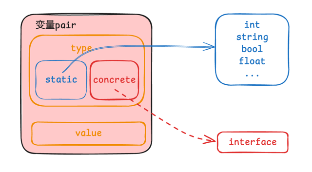

在编程语言中，反射（Reflection）是一种在运行时获取程序自身结构、类型、方法、变量等信息，并能够动态操作这些信息的能力，本文介绍 Golang 中的反射相关的方法和使用场景。
<!--more-->

## 介绍

在编程语言中，反射（Reflection）是一种在运行时获取程序自身结构、类型、方法、变量等信息，并能够动态操作这些信息的能力。

反射允许程序检查和修改其自身的结构和行为。通过反射，程序可以：

* **查看类型信息**：包括类型名称、字段、方法、继承关系等。

* **动态访问和操作对象的属性和方法**：即使在编译时不知道具体的类型。

* **根据运行时的条件创建对象、调用方法。**

正是上面的几点，在实现一些通用的编程框架和库的时候才让我们能够使用反射来处理各种不同类型的对象。
反射为程序提供了极大的灵活性和动态性，但也可能带来性能开销和代码复杂性。它常用于实现诸如序列化 / 反序列化、依赖注入、动态代理、ORM（对象关系映射）框架等功能。
不同的编程语言对反射的支持程度和实现方式可能会有所不同，但核心概念是相似的。

## 变量的Pair
在聊反射之前我们需要先了解变量的组成，这能帮助我们更深刻的理解反射，先放一张图，我们对着图来解释：

我画的可能不够清晰，说一下这张图表达的两个含义：

* **变量包含两个部分**：type 和 value，正是由于这两个部分， golang 存在一个 **nil != nil** 的现象，我们下面再说～

* **type 又存在两种**：static type 和 concrete type，其中前者就是编写代码时指定的类型，例如 int,string,bool ...，而后者的具体类型则是运行时系统才能看见的类型(例如 interface 被赋值成多个类型的数据)，下面会具体代码解释这一点

基于上面两点，我们再说一点：**Golang中的类型断言能否成功，取决于变量的concrete type，而不是static type。**

> Golang 中的基础类型是静态的，也就是说我们创建变量手指定 int,string,bool 的时候，这个变量的 type 就已经是 static type 了，只有 interface 的变量才具备 concrete type ，
> 所以只有运行时 interface 类型才有反射一说

### concrete type
具体(动态)类型较为好理解：程序运行时系统才能看见的类型。下面直接代码解释：
```go
// val 的静态类型是 interface
var val interface{}
// val 的静态类型是 interface，动态类型是 int
val = 1
// val 的静态类型是 interface，动态类型是 string
val = "1"
```
以上类型的变换需要代码执行到具体行数才能决定了动态类型是什么。

### nil != nil
先说最重要的结论：
* **对于静态类型是接口类型的变量，要判断其值是否为 nil ，需要同时判断类型和值都为 nil 。**

* **对于静态类型不是接口类型的变量，通常只需要判断值是否为 nil 。但需要注意的是，对于指针类型的非接口变量，如果指针未初始化或者被显式赋值为 nil ，则判断为 nil。**

为什么 Golang 中存在这个奇怪的现象：**nil != nil**，还是看上文中提到的变量的组成，变量组成的两个部分: type 和 value ,我们在判断变量 val 是不是 nil 的时候：

```go
 // ......
 val == nil
```
左侧是我们的变量 val ,右侧是一个临时的 nil 变量，右侧的 nil 的组成中，type 是 nil，value 也是 nil，而 == 判断的时候会判断左右两个变量的 type 和 value 是否全是一致的，只有
type 和 value 全是一致的这个表达式才会返回 true 。具体看下面的代码：
```go
func TestNil(t *testing.T) {
	// 未初始化的 interface 类型，此时的 val 的 type 和 value 都是 nil，val 是接口类型，比较时需要比较 type 和 value
	var val interface{}
	// val 的值：<nil>，val==nil：true
	t.Logf("val 的值：%v，val==nil：%v", val, val == nil)
	// 将一个 type 和 value 都为 nil 的 nil变量强转为 type 是 *int，value 是 nil 的 nil，当将 (*int)(nil) 赋值给 val 时，val 仍然是接口类型，比较时需要比较 type 和 value。
	val = (*int)(nil)
	// val 的值：<nil>，val==nil：false
	t.Logf("val 的值：%v，val==nil：%v", val, val == nil)
	// 未初始化的 *int 类型，此时的  number 的 type 是 nil, value 为 nil(未指向变量，所以value没存储变量的地址)
	var number *int
	// number 的值：<nil>，number==nil：true
	t.Logf("number 的值：%v，number==nil：%v", number, number == nil)
	// 将一个 type 是 *int 值是 nil的变量赋值给 number，val 是接口类型，比较时需要比较 type 和 value。
	val = number
	// val 的值：<nil>，val==nil：false
	t.Logf("val 的值：%v，val==nil：%v", val, val == nil)
	var temp int
	// count 是一个指向 temp 的指针，存储的 value 是 temp 的内存地址(不是 nil )，即count是已经初始化了的指针
	count := &temp
	// count 的值：0x14000a74438，count==nil：false
	t.Logf("count 的值：%v，count==nil：%v", count, count == nil)
}
```
代码中的注释内容已经详细的解释了比较结果的原因。

## 读取

反射中最常用的方法就是 TypeOf 和 ValueOf 了，这两个方法是获取变量信息的基本途径，其中 TypeOf 方法返回 reflect.Type ,这是一个 interface ，用来获取类型的相关信息，例如类型的名称，
种类（结构体/指针/切片...），字段（对于结构体），方法等。而 ValueOf 方法返回的是一个结构体 reflect.Value ，我们可以借助它来实现读取和修改变量，下面我们介绍一下这两个方法简单的使用。

### TypeOf & ValueOf
这两个方法获取到的就是变量 pair 的类型 type 和 value 的,例如：
```go
func TestTypeOf(t *testing.T) {
    var number int = 100
    t.Log(reflect.TypeOf(number))    // int
    t.Log(reflect.ValueOf(number))   // 100
}
```
执行测试会得到打印 int 和 100，这个 int 就是变量的类型，而 100 就是变量真实的 value。

### reflect.Value相关方法
首先介绍 reflect.ValueOf(i).Interface() ，它的作用是将对象转换为 interface 类型，这样的目的是方便我们使用类型转换和断言来访问变量的原始的具体类型，下面我们直接通过代码来看：

```go
func processSlice(arr interface{}, t *testing.T) {
	val := reflect.ValueOf(arr)
	kind := val.Kind()
	if kind != reflect.Slice && kind != reflect.Array {
		t.Error("参数不是slice/array类型,不处理")
		return
	}
	for i := 0; i < val.Len(); i++ {
		ele := val.Index(i)
		t.Logf("变量索引：%d，元素类型：%s，元素Value：%v\n", i, ele.Type(), ele )
	}
}
func TestReflectValueInterface(t *testing.T) {
    arr1 := []string{"a", "b", "c"}
    arr2 := [...]int{1, 2, 3}
    arr3 := []float64{0.1, 2.0, 3.0}
    processSlice(arr1, t)
    processSlice(arr2, t)
    processSlice(arr3, t)
}
```
执行测试，输出内容如下：
```shell
    reflect_test.go:111: 变量索引：0，元素类型：string，元素Value：a
    reflect_test.go:111: 变量索引：1，元素类型：string，元素Value：b
    reflect_test.go:111: 变量索引：2，元素类型：string，元素Value：c
    reflect_test.go:111: 变量索引：0，元素类型：int，元素Value：1
    reflect_test.go:111: 变量索引：1，元素类型：int，元素Value：2
    reflect_test.go:111: 变量索引：2，元素类型：int，元素Value：3
    reflect_test.go:111: 变量索引：0，元素类型：float64，元素Value：0.1
    reflect_test.go:111: 变量索引：1，元素类型：float64，元素Value：2
    reflect_test.go:111: 变量索引：2，元素类型：float64，元素Value：3
```
可以看到除了 Interface 方法是获取元素原本的值的，还涉及到其他的一些方法。

下面我们简单介绍一下方法涉及到的一些方法：

* reflect.Value.Kind：返回一个 reflect.Kind 类型的值，这个值表示被检查的变量的基本类型（如 int, float, slice 等）。这个方法通常用于判断变量的基本类型分类，这对于编写处理不同数据类型的通用代码非常有用。

* reflect.Value.Len：返回一个 reflect.Value 类型值的长度，适用于**Array**, **Chan**, **Map**, **Slice**, **String**等类型。如果对不支持 Len() 方法的类型调用此方法则会引发运行时恐慌。

* reflect.Value.Index：方法返回数组、切片或字符串中索引为 i 的元素的 reflect.Value 表示。这使得你可以获取并操作这些集合类型中的具体元素。

* reflect.Value.Index：和 TypeOf 一样，返回 reflect.Value 的具体类型，返回类型为 reflect.Type。这可以用来获取更多关于变量的类型信息，如其名称、是否实现了某个接口等。

除此之外，我们还可以获取变量的方法和字段：

```go
func readFieldAndMethod(param interface{}, t *testing.T) {
	typ := reflect.TypeOf(param)
	val := reflect.ValueOf(param)
	if typ.Kind() == reflect.Struct {
		// 获取结构体的字段名称和字段值
		for i := 0; i < typ.NumField(); i++ {
			t.Logf("字段名称：%s,字段值：%v", typ.Field(i).Name, val.Field(i).Interface())
		}
		for i := 0; i < typ.NumMethod(); i++ {
			t.Logf("方法名称：%s,方法Type：%s\n", typ.Method(i).Name, typ.Method(i).Type)
		}
	} else {
		t.Error("参数不是结构体")
	}

}

type Student struct {
	Name string `json:"name"`
	Age  int    `json:"age"`
}

func (s Student) Sleep() {
	fmt.Println(s.Name + " is sleeping...")
}

func TestReadFieldAndMethod(t *testing.T) {
	readFieldAndMethod(Student{
		Name: "测试名称",
		Age:  20,
	}, t)
}
```
在 readFieldAndMethod 方法中我们通过 NumField 来获取字段数量，然后遍历使用 Field 方法获取每一个 StructField，同样的，根据 NumMethod 方法获取方法数量，遍历根据 Method 方法
获取每一个 Method。

## 修改

我们可以通过反射去设置变量的值，但是前提条件这个变量是可寻址的，也就是说我们在使用 reflect.ValueOf(v) 中的参数 v 要是一个指针。

例如下面的代码就使用的了 reflect.value 的 CanAddr 方法来获取一个变量是不是可以寻址的：

```go
func TestReflect(t *testing.T) {
	x := 10
	v := reflect.ValueOf(x) // v 就是字面量 10
	fmt.Println("CanAddr of x:", v.CanAddr()) // 输出 false，因为直接传递 x 的值(字面量10)，不可寻址(x变量是可寻址的)

	p := &x
	vp := reflect.ValueOf(p).Elem()
	fmt.Println("CanAddr of p:", vp.CanAddr()) // 输出 true，因为传递了 x 的指针并通过 Elem() 获取指向的值（指向的是变量x），可寻址（x变量是可寻址的）
}
```
### Elem
其中 Elem 方法返回值是 reflect.Value ，主要用于从包含实际数据的指针或接口类型中获取出数据的反射值（reflect.Value）。

* 指针：当 reflect.Value 表示一个指针时，Elem() 用于访问指针指向的值。

* 接口：当 reflect.Value 表示一个接口时，Elem() 用于获取接口实际持有的动态值。

> 在 Go 语言中，“addressable”（可寻址）是一个重要的概念。
> 一个值是可寻址的，意味着可以获取到它的内存地址。
> 可寻址性在以下几个方面具有重要意义：
> * 对于通过反射修改值：只有可寻址的值才能通过反射进行修改。
> * 指针操作：要获取一个值的指针，该值必须是可寻址的。
> * 赋值和参数传递：某些操作要求值是可寻址的，以便正确地进行赋值或在函数参数传递中进行修改。
> 
> 例如，对于一个不可寻址的值，如一个临时变量、函数返回的值或不可变的值，就不能直接获取其地址。
> 而像变量、可寻址的数组或切片元素、可寻址的结构体字段等通常是可寻址的。

直接通过代码来看如何修改变量的值：
```go
func rewriteByReflect(t *testing.T, params interface{}) {
	reflectValue := reflect.ValueOf(params)
	if reflectValue.Kind() != reflect.Ptr {
		t.Error("传入的参数不是一个指针")
		return
	}
	if !reflectValue.Elem().CanAddr() {
		t.Error("传入的参数指向的元素不可寻址")
		return
	}
	if !reflectValue.Elem().CanSet() {
		t.Error("传入的参数指向的元素不可修改")
		return
	}
	ele := reflectValue.Elem()
	switch ele.Kind() {
	case reflect.Int:
		ele.SetInt(ele.Int() * 2)
	case reflect.String:
		ele.SetString(ele.String() + " is changed!!!")
	default:
		panic("unhandled default case")
	}
}

func TestReflect(t *testing.T) {
	number := 10
	rewriteByReflect(t, &number)
	t.Logf("%d\n", number)
	str := "字符串"
	rewriteByReflect(t, &str)
	t.Logf("%s\n", str)
}
```
这段代码演示了如何借助反射的相关方法修改变量的值，下面介绍一下主要涉及到的方法：
### CanAddr & CanSet

* reflect.Value.CanAddr：用于判断一个 reflect.Value 是否可以被寻址（可寻址不代表可设置）。

* reflect.Value.CanSet：用于判断一个 reflect.Value 是否可以被修改。如果一个 reflect.Value 是可设置的，你可以使用 SetXXX 方法（如 SetInt, SetFloat, SetString 等）来修改它所代表的原始变量的值。

1. **可寻址并不意味着可设置**：一个 reflect.Value 可以是可寻址的但不可设置的。例如，如果你通过 reflect.ValueOf() 传递了一个未导出的结构体字段，即使它是可寻址的，你也不能修改它，因为它是未导出的。

2. **可设置一定可寻址**：只有可寻址的 reflect.Value 才可能是可设置的，因为只有直接引用原始数据的 reflect.Value 才可能允许修改其数据。

举例说明：
```go
type User struct {
	privateField int
}

func TestReflect(t *testing.T) {
	user := &User{privateField: 1}
	val := reflect.ValueOf(user).Elem()
	t.Logf("elem CanAddr：%t", val.CanAddr())
	field := val.FieldByName("privateField")
	t.Logf("privateField CanAddr: %t", field.CanAddr())
	t.Logf("privateField CanSet: %t", field.CanSet())
}
```
输出结果：
```shell
    reflect_test.go:15: elem CanAddr：true
    reflect_test.go:17: privateField CanAddr: true
    reflect_test.go:18: privateField CanSet: false
```

## 调用
reflect 包不仅可以检查变量的类型和值，设置变量，还允许你动态地调用方法。这在处理不确定类型或需要在运行时决定调用哪个方法的情况下非常有用。下面简单说明调用的步骤：

1. 获取类型和值：首先，你需要有一个包含方法的对象的 reflect.Value。
2. 方法的查找：使用 MethodByName() 或 Method() 方法从 reflect.Value 中获取方法。
3. 参数的准备：创建一个 []reflect.Value 列表来包含你想传递给方法的参数。
4. 调用方法：使用 Call() 方法来调用你从 reflect.Value 中得到的方法。
5. 处理返回值：Call() 方法返回一个 []reflect.Value 列表，表示方法的返回值，你可以处理这些返回值。

代码示例：
```go
type User struct {
	Name string
}
type UserInfo struct {
	Name string
	Date time.Time
}

func (u *User) SaySomething(content string) string {
	s := fmt.Sprintf("%s发表了内容: %s", u.Name, content)
	fmt.Println(s)
	return s
}

func (u *User) GetInfo() UserInfo {
	return UserInfo{
		Name: u.Name,
		Date: time.Now(),
	}
}

func TestReflect(t *testing.T) {
	user := &User{
		Name: "策划师",
	}
	// 接收器*User存在方法SaySomething
	value := reflect.ValueOf(user)
	methodByName := value.MethodByName("SaySomething")
	// 确认是否存在该方法
	if methodByName.IsValid() {
		result := methodByName.Call([]reflect.Value{reflect.ValueOf("hello")})
		for _, v := range result {
			temp := v.Interface()
			t.Log(temp.(string))
		}
	}
	methodByName = value.MethodByName("GetInfo")
	if methodByName.IsValid() {
		result := methodByName.Call(nil)
		info := result[0]
		if info.CanInterface() {
			temp := info.Interface().(UserInfo)
			t.Log(temp)
		}
	}
}
```
### MethodByName

MethodByName() 方法用于通过其名称查找类型的方法。它接受一个字符串作为参数，这个字符串是你想要调用的方法的名称。如果该方法存在，MethodByName() 返回一个 reflect.Value，
代表那个方法。如果不存在，返回的 reflect.Value 将是无效的（IsValid() 方法会返回 false，下面会介绍 IsValid 方法）。

### Call

Call() 方法用于调用由 reflect.Value 表示的方法。它接受一个 reflect.Value 的切片，这些 reflect.Value 表示要传递给方法的参数，并返回一个 reflect.Value 切片，
这些切片表示方法的返回值。Call() 方法可以处理任意数量的参数和返回值。

### IsValid
IsValid() 方法用于检查 reflect.Value 是否持有一个有效的非零值。它会判断一个 reflect.Value 是否代表了一个真实存在的值，或者它是否是一个无效的、零值的 reflect.Value。

一般的使用场景是下面三个：

* 判断零值：如果 reflect.Value 是由 reflect.ValueOf(nil) 或未初始化的 reflect.Value 创建的，那么 IsValid() 会返回 false。

* 检查字段存在性：当查找结构体的字段/方法时，如果字段/方法不存在，返回的 reflect.Value 将是无效的，此时 IsValid() 会返回 false。

* 安全地处理反射值：在尝试调用 reflect.Value 上的方法如 Interface(), Type(), Kind() 等之前，使用 IsValid() 可以避免运行时错误（panic）。

### CanInterface

CanInterface() 方法是用来检查一个 reflect.Value 是否可以安全地使用 Interface() 方法转换回一个普通的 interface{} 类型。
使用 Interface() 方法可以让你从 reflect.Value 中获取原始值，但这个操作在某些情况下可能是不安全的，尤其是对于未导出的（非公开的）字段或方法。

## 性能
反射在 Go 语言中是一个非常强大的特性，它允许程序在运行时检查、修改和动态调用对象的类型和值。
但是，与直接的静态类型访问和方法调用相比，反射的性能通常较差。这种性能差异主要由以下几个原因造成：
* 放弃了安全的类型：Go中的反射依靠的是动态类型，运行时需要进行更多的检查来保证操作的安全（CanSet/CanInterface/CanAddr这类方法都是检查类型安全的）。

* 间接的访问字段和方法：反射通常比直接的方法调用或字段访问有更多的间接层次。每次使用反射访问或调用时，都涉及到在内部数据结构中查找和解析类型信息。这种间接性增加了调用的复杂性和开销。

* 无法优化方法调用：使用反射动态调用方法时，Go 运行时不能对这些调用进行静态分析和优化，如内联展开等编译器优化策略。这意味着即使是简单的方法调用也可能涉及复杂的查找和分派逻辑。

* 额外的内存分配：反射通常需要更多的内存分配。例如，当使用 reflect.Call 方法时，参数和返回值通常需要封装在 []reflect.Value 切片中，这需要额外的堆分配。

综合来看虽然反射提供了极大的灵活性和动态功能，但它的性能成本通常较高，因此应用中应谨慎使用。在性能关键的应用中，应尽量避免使用反射，或者尽可能将反射的使用限制在不影响整体性能的程度。
在可能的情况下，考虑使用其他方法如接口和类型断言来代替反射，这些方法可以提供类似的灵活性，同时保持更好的性能。