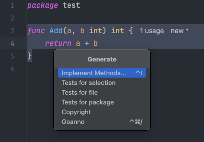

随着项目的复杂度和层级越来越复杂，单元测试和模糊测试成为项目不可或缺的一部分，
本文介绍在Golang的项目中如何书写单元/模糊测试以及一些常见的测试技巧，帮助开发者发现潜在的问题。
<!--more-->

## 快速入门

Go 自带了一个轻量级的测试框架，由 go test 命令和 testing 包组成，官方推荐将测试文件和需要测试的文件放在同一个目录下：例如文件 add.go 文件中的方法 add 需要测试，
直接在同目录创建 add_test.go 即可。

所有结尾为 _test.go 的文件都被视为单元测试文件，不会被编译到可执行文件中，同时单元测试文件中的测试用例需要以 Test/Benchmark/Fuzz/Example 开头，下面是不同前缀的对应关系：

| 类型   | 函数前缀      | 作用              |
|------|-----------|-----------------|
| 基础测试 | Test      | 对需要测试的方法和业务进行测试 |
| 基准测试 | Benchmark | 测试方法的性能         |
| 模糊测试 | Fuzz      | 自动化测试方法         |
| 示例   | Example   | 自动化测试方法         |

下面简单介绍如何快速实现一个方法的测试：
```go {filename="add.go"}
// 需要测试的方法
func Add(a, b int) int {
    return a + b
}
```
创建单元测试文件 add_test.go 如下：
```go {filename="add_test.go"}
func TestAdd(t *testing.T) {
	if result := Add(1, 2); result != 3 {
		t.Errorf("Add(1, 2) = %d; want 3", result)
	}
}
```

执行 `go test` 会运行全部的测试用例，加入当前 package 下的全部测试，加入当前的包下只有这一个测试用例，输出如下：
```shell
PASS
ok      gin-web/test    0.438s
```

如果需要查看执行的详情，执行 `go test -v`即可：
```shell
go test -v
=== RUN   TestAdd
--- PASS: TestAdd (0.00s)
PASS
ok      gin-web/test    0.247s
```

如果需要查看测试的覆盖率，则加上 -cover 即可：
```shell
go test -cover
PASS
coverage: 100.0% of statements
ok      gin-web/test    0.253s
```

如果存在很多个测试用例，而你只希望执行某些测试，则加上 -run ，run 参数是一个正则匹配，你可以使用通配符之类的匹配规则：
```shell
go test -run TestAdd -v
=== RUN   TestAdd
--- PASS: TestAdd (0.00s)
PASS
ok      gin-web/test    0.253s
```
## testing包

这部分主要用于简单的介绍 testing 包下的一些常见成员及其常用的方法，部分内容会在下面的章节详细介绍。

### testing.T

* Error 和 Errorf：记录测试中的错误信息，同时标记测试为失败，不会停止测试函数的执行。

  * t.Error(args...)：类似于 fmt.Println，记录错误信息。
  
  * t.Errorf(format, args...)：类似于 fmt.Printf，使用格式化字符串记录错误信息。

* Fatal 和 Fatalf：记录测试中的错误信息，并立即终止当前测试函数的执行。

  * t.Fatal(args...)：类似于 fmt.Println，记录错误信息并终止测试。
  
  * t.Fatalf(format, args...)：类似于 fmt.Printf，使用格式化字符串记录错误信息并终止测试。

* Log 和 Logf：记录测试中的日志信息，但不影响测试的状态（不会标记为失败）。

  * t.Log(args...)：类似于 fmt.Println，记录日志信息。
  
  * t.Logf(format, args...)：类似于 fmt.Printf，使用格式化字符串记录日志信息。

* Run：用于运行一个子测试（subtest）。Run 方法可以创建一个逻辑上的子测试，它有自己独立的 *testing.T，并且可以并发执行。

  * t.Run(name string, f func(t *testing.T))：创建并执行一个子测试。

* Skip 和 Skipf：用于在特定条件下跳过测试。
  
  * t.Skip(args...)：类似于 fmt.Println，记录跳过的原因并跳过测试。
  
  * t.Skipf(format, args...)：类似于 fmt.Printf，使用格式化字符串记录跳过的原因并跳过测试。

* Helper：将当前函数标记为一个帮助函数，以便在记录错误时省略它的调用信息。这有助于提高错误日志的清晰度。
  
  * t.Helper()：在帮助函数的开头调用。

* Parallel：标记当前测试为可以并行运行，与其他并行测试一起执行。通常用于需要并发测试的场景。

  * t.Parallel()：在测试函数的开头调用。

* Cleanup：用于注册一个在测试完成后（无论成功还是失败）都会执行的清理函数。

    

### testing.B

* b.ResetTimer()：重置计时器，忽略之前的代码执行时间。例如，在基准测试中执行一些初始化操作后，重置计时器只记录实际的测试部分时间。

* b.StartTimer() 和 b.StopTimer()：控制计时器的启动和停止，适合需要手动控制基准测试时间的场景。

* b.RunParallel()：用于测试并行执行的性能。这个方法允许基准测试并行运行多个 Goroutine，从而测试并发性能。

### testing.M

testing.M 是 testing 包中用于控制整个测试过程的结构体。在需要进行测试前后全局初始化和清理操作时，testing.M 非常有用。它通常在 TestMain 函数中使用。

* TestMain：是一个特殊的测试主入口函数，签名为 func TestMain(m *testing.M)，它在所有测试开始之前执行，通常用于设置全局状态或初始化资源（例如数据库连接、读取配置等）。

  * m.Run() 方法用于运行所有测试，返回值是测试结果的状态码（0 表示成功）。

### 跳过部分测试

为了节省时间，我们借助 testing.Short 和 testing.T.Skip 方法来标记和跳过当前的测试用例，当运行的实施传入 -short 参数，就可以跳过一部分测试代码。

```go
func TestShort(t *testing.T) {
	if testing.Short() {
		t.Skip("skipping test in short mode.")
	}
	t.Log("代码逻辑")
}
```
在命令行中执行 ` go test -short -v` 后，将跳过当前测试用例：

```shell
=== RUN   TestShort
    a_test.go:9: skipping test in short mode.
--- SKIP: TestShort (0.00s)
PASS
ok      gin-web 0.314s
```

## 子测试 & Table-Driven Approach

前面介绍了 *testing.T 的 Run 方法，支持创建子测试，我们为前问的 Add 方法来创建多个子测试。

```go
func TestAdd(t *testing.T) {
	t.Run("1+1", func(t *testing.T) {
		if got := Add(1, 1); got != 2 {
			t.Errorf("Add(1,1) = %d, want %d\n", got, 2)
		}
	})
	t.Run("-1+1", func(t *testing.T) {
		if got := Add(-1, 1); got != 0 {
			t.Errorf("Add(-1,1) = %d, want %d\n", got, 0)
		}
	})
	t.Run("-1+-1", func(t *testing.T) {
		if got := Add(-1, -1); got != -2 {
			t.Errorf("Add(-1,-1) = %d, want %d\n", got, -2)
		}
	})
}
```
执行 `go test -v`后，我们能查看到每一个子用例的执行结果：
```shell
=== RUN   TestAdd
=== RUN   TestAdd/1+1
=== RUN   TestAdd/-1+1
=== RUN   TestAdd/-1+-1
--- PASS: TestAdd (0.00s)
    --- PASS: TestAdd/1+1 (0.00s)
    --- PASS: TestAdd/-1+1 (0.00s)
    --- PASS: TestAdd/-1+-1 (0.00s)
PASS
ok      gin-web 0.293s
```

使用子测试可以为一个测试目标创建多个用例，但是依旧比较麻烦，所以官方还推荐我们使用 Table-Driven Approach 来实现方法的大量数据集测试。

Table-Driven Approach 也就是为测试用例准备表格一样的数据来作为参数，后续不需要调整测试用例本身，在扩展用例的时候只需要扩展这份数据即可，例如下面这个例子来测试前问的 Add 方法：

```go
func TestAdd(t *testing.T) {
	type args struct {
		a int
		b int
	}
	tests := []struct {
		name string
		args args
		want int
	}{
		{
			name: "1+1",
			args: args{1, 1},
			want: 2,
		},
		{
			name: "-1+-1",
			args: args{-1, -1},
			want: -2,
		},
		{
			name: "0+0",
			args: args{0, 0},
			want: 0,
		},
	}
	for _, tt := range tests {
		t.Run(tt.name, func(t *testing.T) {
			if got := Add(tt.args.a, tt.args.b); got != tt.want {
				t.Errorf("Add() = %v, want %v", got, tt.want)
			}
		})
	}
}
```
在后续的扩展中，我们只需要扩展 cases 即可。

## 并行测试

前面提到的子测试和 Table-Driven Approach 存在大量的子测试用例需要执行，这些用例的执行是顺序的，我们很容易发现我们可以借助 Golang 优秀的并发实现来完成用例的并发执行。

例如存在这样的三个测试：
```go
func TestA(t *testing.T) {
	time.Sleep(time.Second)
	t.Log("TestA is running...")
}

func TestB(t *testing.T) {
	time.Sleep(3 * time.Second)
	t.Log("TestB is running...")
}

func TestC(t *testing.T) {
	t.Run("TestC1", func(t *testing.T) {
		time.Sleep(3 * time.Second)
		t.Log("TestC1 is running...")
	})
	t.Run("TestC2", func(t *testing.T) {
		time.Sleep(5 * time.Second)
		t.Log("TestC2 is running...")
	})
}
```
执行 `go test -v` 查看运行结果和耗时，发现一共需要 12s 以上，如果存在很多耗时的测试用例，这样的时间是无法忍受的：
```shell
=== RUN   TestA
    a_test.go:32: TestA is running...
--- PASS: TestA (1.00s)
=== RUN   TestB
    a_test.go:37: TestB is running...
--- PASS: TestB (3.00s)
=== RUN   TestC
=== RUN   TestC/TestC1
    a_test.go:43: TestC1 is running...
=== RUN   TestC/TestC2
    a_test.go:47: TestC2 is running...
--- PASS: TestC (8.00s)
    --- PASS: TestC/TestC1 (3.00s)
    --- PASS: TestC/TestC2 (5.00s)
PASS
ok      gin-web 12.327s
```
下面我们借助 `Parallel` 来开启并发执行用例：

```go
func TestA(t *testing.T) {
	t.Parallel()
	time.Sleep(time.Second)
	t.Log("TestA is running...")
}

func TestB(t *testing.T) {
	t.Parallel()
	time.Sleep(3 * time.Second)
	t.Log("TestB is running...")
}

func TestC(t *testing.T) {
	t.Parallel()
	t.Run("TestC1", func(t *testing.T) {
		t.Parallel()
		time.Sleep(3 * time.Second)
		t.Log("TestC1 is running...")
	})
	t.Run("TestC2", func(t *testing.T) {
		t.Parallel()
		time.Sleep(5 * time.Second)
		t.Log("TestC2 is running...")
	})
}
```
再次执行 `go test -v` 查看执行，发现只需要 5s 左右了：

```shell
=== RUN   TestA
=== PAUSE TestA
=== RUN   TestB
=== PAUSE TestB
=== RUN   TestC
=== PAUSE TestC
=== CONT  TestA
=== CONT  TestB
=== CONT  TestC
=== RUN   TestC/TestC1
=== PAUSE TestC/TestC1
=== RUN   TestC/TestC2
=== PAUSE TestC/TestC2
=== CONT  TestC/TestC1
=== CONT  TestC/TestC2
=== NAME  TestA
    a_test.go:33: TestA is running...
--- PASS: TestA (1.00s)
=== NAME  TestC/TestC1
    a_test.go:47: TestC1 is running...
=== NAME  TestB
    a_test.go:39: TestB is running...
--- PASS: TestB (3.00s)
=== NAME  TestC/TestC2
    a_test.go:52: TestC2 is running...
--- PASS: TestC (0.00s)
    --- PASS: TestC/TestC1 (3.00s)
    --- PASS: TestC/TestC2 (5.00s)
PASS
ok      gin-web 5.315s
```
并行测试能在子测试场景下节约大量的执行时间，尤其在子测试很多同时子测试存在耗时操作的时候，效率提升明显。

## 帮助函数

很多时候我们会将一部分通用逻辑抽离成为一个独立的方法，类似前面提到的表格驱动测试法，不过抽离出来的独立的方法报错信息可能不像表格驱动一样的直观，例如下面的例子：

```go
type args struct {
	a int
	b int
}

type testCase struct {
	name string
	args args
	want int
}

func createAddCase(t *testing.T, tt testCase) {
	if got := Add(tt.args.a, tt.args.b); got != tt.want {
		t.Errorf("Add() = %v, want %v", got, tt.want)
	}
}

func TestAdd(t *testing.T) {
	tests := []testCase{
		{
			name: "1+1",
			args: args{1, 1},
			want: 2,
		},
		{
			name: "-1+-1",
			args: args{-1, -1},
			want: -2,
		},
		{
			name: "0+1",
			args: args{0, 1},
			want: 0,
		},
	}
	for _, tt := range tests {
		t.Run(tt.name, func(t *testing.T) {
			createAddCase(t, tt)
		})
	}
}
```
执行 `go test -v` 之后：

```shell
=== RUN   TestAdd
=== RUN   TestAdd/1+1
=== RUN   TestAdd/-1+-1
=== RUN   TestAdd/0+0
    add_test.go:18: Add() = 1, want 0
--- FAIL: TestAdd (0.00s)
    --- PASS: TestAdd/1+1 (0.00s)
    --- PASS: TestAdd/-1+-1 (0.00s)
    --- FAIL: TestAdd/0+0 (0.00s)
FAIL
exit status 1
FAIL    gin-web/test    0.469s
```
从报错信息来看，我们只能看到报错行数是封装出来的的函数，而不清楚调用者的行数，而借助 Helper 我们可以查看调用者的信息：

```go
func createAddCase(t *testing.T, tt testCase) {
	t.Helper()
	if got := Add(tt.args.a, tt.args.b); got != tt.want {
		t.Errorf("Add() = %v, want %v", got, tt.want)
	}
}
```
从下面的执行信息可以很简单的发现错误调用来自 add_test.go:43 ,比之前的 add_test.go:18 更能方便开发者找到调用者的信息：
```shell
=== RUN   TestAdd
=== RUN   TestAdd/1+1
=== RUN   TestAdd/-1+-1
=== RUN   TestAdd/0+1
    add_test.go:43: Add() = 1, want 0
--- FAIL: TestAdd (0.00s)
    --- PASS: TestAdd/1+1 (0.00s)
    --- PASS: TestAdd/-1+-1 (0.00s)
    --- FAIL: TestAdd/0+1 (0.00s)
FAIL
exit status 1
FAIL    gin-web/test    0.917s
```

## Setup & Teardown

很多时候，在执行测试用例的前后阶段我们需要执行一些初始化和清理的行为，或者很多个测试用例的前后逻辑都是一样的，一般这种场景需要借助 Setup 来做执行用例前的初始化，用 Teardown 来做清理和资源回收类的动作。

这里要引入 TestMain 函数，TestMain 方法是一个测试文件的 Main 方法，执行其他用例之前都会执行它，函数签名：func TestMain(m *testing.M)，其中 m.Run 方法的前后可以执行 Setup 和 Teardown，同时应该使用方法执行的返回值作为参数调用 os.Exit 。

```go
func TestMain(m *testing.M) {
    // setup
	fmt
	r := m.Run()    
	// teardown
	os.Exit(r)                           
}
```
其中 m.Run 默认将执行文件内的全部用例，也可以通过 -run 来指定要匹配的用例。

## 网络测试

很多时候，在 Web 工程中，我们需要在 API 开发完成后测试接口能够正常工作，为了贴近实际，这部分一般不实用 Mock 技术来模拟，我们需要发送真实的网络请求来测试。

### 测试 HTTP Server Handler
在不借助其他社区框架， Golang 官方库就能快速实现一个简单的 HTTP Server Handler：

```go
func upperCaseHandler(w http.ResponseWriter, r *http.Request) {
	query, err := url.ParseQuery(r.URL.RawQuery)
	if err != nil {
		w.WriteHeader(http.StatusBadRequest)
		return
	}
	keyword := query.Get("keyword")
	if strings.TrimSpace(keyword) == "" {
		w.WriteHeader(http.StatusBadRequest)
		return
	}
	w.WriteHeader(http.StatusOK)
	_, _ = w.Write([]byte(strings.ToUpper(keyword)))
}

func main() {
	http.HandleFunc("/upper", upperCaseHandler)
	err := http.ListenAndServe(":8080", nil)
	if err != nil {
		panic(err)
	}
}
```
假设现在存在这样一个 API，我们需要验证 upperCaseHandler 能够正常工作，可以分为2个步骤：

* 创建请求：借助 httptest.NewRequest 方法创建 http.Request 

* 记录响应：借助 httptest.NewRecorder 实现 http.ResponseWriter，该类型返回httptest.ResponseRecorder，可以借助它进行后续的记录和断言

```go
func TestPingHandler(t *testing.T) {
	request := httptest.NewRequest("http.MethodGet", "/upper?keyword=abc", nil)
	recorder := httptest.NewRecorder()
	upperCaseHandler(recorder, request)
	response := recorder.Result()
	if response.StatusCode != http.StatusOK {
		t.Errorf("handler returned wrong status code: got %v want %v", response.StatusCode, http.StatusOK)
	}
	all, err := io.ReadAll(response.Body)
	if err != nil {
		t.Errorf("handler returned unexpected body: got %v want nil", err)
	}
	if string(all) != "ABC" {
		t.Errorf("handler returned unexpected body: got %v want %v", response.Body, "ABC")
	}
}
```
执行 `go test -v` 查看结果：

```shell
=== RUN   TestPingHandler
--- PASS: TestPingHandler (0.00s)
PASS
ok      gin-web 0.266s
```

### 测试HTTP Client

前面的测试是直接测试了 upperCaseHandler 来验证方法逻辑，但是如果需要测试 一个 HTTP Client 的逻辑 ，我们并不关系服务器端的接口实现，但是很难实现对整个服务器的模拟，例如下面这个例子：

```go
type Client struct {
	URL string
}

func NewClient(url string) *Client {
	return &Client{url}
}

func (c *Client) UpperCase(keyword string) (string, error) {
	resp, err := http.Get(c.URL + "?keyword=" + keyword)
	if err != nil {
		return "", err
	}
	all, err := io.ReadAll(resp.Body)
	if err != nil {
		return "", err
	}
	return strings.ToUpper(string(all)), nil
}
```
其中 UpperCase 方法使用了 http.Get 向远端发送了请求，我们如何模拟这个远端服务器？

下面介绍我么应该如何实现一个模拟的 Server ，借助 httptest.NewServer 我们能定义一个 Server 来自定义想要的远端服务，具体看下面的示例代码：

```go
func TestClient(t *testing.T) {
	want := "abc"
	server := httptest.NewServer(http.HandlerFunc(func(w http.ResponseWriter, r *http.Request) {
		_, _ = w.Write([]byte(want))
	}))
	defer server.Close()
	client := NewClient(server.URL)
	result, err := client.UpperCase(want)
	if err != nil {
		t.Errorf("handler returned unexpected body: got %v want nil", err)
	}
	if result != strings.ToUpper(want) {
		t.Errorf("handler returned unexpected body: got %v want %v", result, want)
	}
}
```
httptest.NewServer 能帮我们快速模拟一个远端的服务，我们只需要关心我们的业务逻辑的测试，而不用将大量的时间花费在建立远端的服务器和 API。

### 测试Gin框架下的API

除了前面的两种情况，大多数时候，我们的服务都是依赖一些 Web 框架实现的，下面介绍如何测试 Gin 框架的 API，其他框架大同小异，这里给出一些参考和大致的步骤：

这是我们要测试的 API 实现：
```go
func Upper(ctx *gin.Context) {
	keyword := ctx.Query("keyword")
	if keyword == "" {
		ctx.AbortWithStatus(http.StatusBadRequest)
		return
	}
	ctx.String(http.StatusOK, strings.ToUpper(keyword))
}
```
针对这个方法，我们的测试用例需要完成几个步骤：

* 创建 Gin 服务，如果存在多个用例，我们可以考虑借助前面的 Setup 来在 TestMain 统一创建。

* 挂载路由，将要测试的方法挂载到 Gin 路由上。

* 借助 httptest.NewRequest 和 httptest.NewRecorder 创建请求和响应记录。

> gin.Default 创建出来的的 engine 实际上实现了 http.Handler，我们可以方便的调用它的 ServeHTTP 方法传入请求和响应记录对象来完成测试，类似前文测试 HTTP Server Handler：


```go
func setup() *gin.Engine {
	engine := gin.Default()
	return engine
}

func TestUpper(t *testing.T) {
	engine := setup()
	engine.GET("/upper", Upper)
	tests := []struct {
		name string
		args string
		want string
		code int
	}{
		{
			name: "normal string",
			args: "abc",
			want: "ABC",
			code: http.StatusOK,
		},
		{
			name: "empty string",
			args: "",
			want: "",
			code: http.StatusBadRequest,
		},
	}
	for _, tt := range tests {
		t.Run(tt.name, func(t *testing.T) {
			request := httptest.NewRequest(http.MethodGet, "/upper?keyword="+tt.args, nil)
			response := httptest.NewRecorder()
			engine.ServeHTTP(response, request)
			if response.Code != tt.code {
				t.Errorf("got %v, want %v", response.Code, tt.code)
				return
			}
			if response.Body.String() != tt.want {
				t.Errorf("got %s, want %s", response.Body.String(), tt.want)
			}
		})
	}
}
```

测试结果：
```shell
=== RUN   TestUpper/normal_string
[GIN] 2024/10/23 - 16:23:30 | 200 |       5.167µs |       192.0.2.1 | GET      "/upper?keyword=abc"
=== RUN   TestUpper/empty_string
[GIN] 2024/10/23 - 16:23:30 | 400 |       1.167µs |       192.0.2.1 | GET      "/upper?keyword="
--- PASS: TestUpper (0.00s)
    --- PASS: TestUpper/normal_string (0.00s)
    --- PASS: TestUpper/empty_string (0.00s)
PASS
```

## 基准测试

基准测试目的是测试在一定负载情况下的程序性能，基准测试函数签名：`func BenchmarkName(b *testing.B)`，执行基准测试需要使用参数 `-bench`.

在基准测试函数内部，通过一个循环执行被测试的代码。b.N 会根据需要自动调整，以确保测试有足够的运行时间来获取准确的性能数据。

下面我们简单的测试 Add 方法：

```go
func BenchmarkAdd(b *testing.B) {
	for i := 0; i < b.N; i++ {
		Add(1, 1)
	}
}
```
执行 `go test -v -bench=Add` 输出如下：
```shell
goos: darwin
goarch: arm64
pkg: gin-web
BenchmarkAdd
BenchmarkAdd-8          1000000000               0.2973 ns/op
PASS
ok      gin-web 1.068s
```
其中 BenchmarkAdd-8 中的8代表启用的GOMAXPROCS，0.2973 ns/op 表示 1000000000 次调用每次平均耗时 0.2973 ns。

### 内存基准测试

除了 `-bench` 之外，我们还可以查看统计内存占用的情况，使用 `-benchmem` 参数即可启用：

```shell
go test -v -bench=Add -benchmem
```
输出如下：
```shell
goos: darwin
goarch: arm64
pkg: gin-web
BenchmarkAdd
BenchmarkAdd-8          1000000000               0.2970 ns/op          0 B/op          0 allocs/op
PASS
ok      gin-web 1.161s
```
其中，0 B/op表示每次操作内存分配0字节，0 allocs/op则表示每次操作进行0次内存分配，因为 Add 方法不涉及内存分配等行文。

### 排除耗时操作

如果基准测试存在一部分我们不关心的耗时操作，可以将这部分排除出时间统计之外，让基准测试只测试我们关心的部分：

```go
func setup() {
	time.Sleep(time.Second * 3)
}

func BenchmarkAdd(b *testing.B) {
	setup()
	for i := 0; i < b.N; i++ {
		Add(1, 1)
	}
}
```
上面的测试用例中 setup 是一个耗时操作，并不是我们要测试的方法主体，我们如果直接执行测试会得到一个这样的结果：

```shell
goos: darwin
goarch: arm64
pkg: gin-web
BenchmarkAdd
BenchmarkAdd-8   	       1	3001135458 ns/op
PASS
```
3001135458 ns/op 并不是 Add 方法执行的速度，我们需要校准时间。

```go
func BenchmarkAdd(b *testing.B) {
	setup()
	b.ResetTimer()
	for i := 0; i < b.N; i++ {
		Add(1, 1)
	}
}
```
再次测试，得到一个我们关心的值：

```shell
goos: darwin
goarch: arm64
pkg: gin-web
BenchmarkAdd
BenchmarkAdd-8   	507145735	         2.075 ns/op
PASS
```
### 并发基准测试
和单元测试一样，基准测试的执行也是顺序的，如果我们需要模拟并发的场景下的性能，可以像下面的例子一样借助 RunParallel 方法：
```go
func BenchmarkAdd(b *testing.B) {
	b.RunParallel(func(pb *testing.PB) {
		for pb.Next() {
			Add(1, 1)
		}
	})
}
```
执行结果：
```shell
goos: darwin
goarch: arm64
pkg: gin-web
BenchmarkAdd
BenchmarkAdd-8   	1000000000	         0.5857 ns/op
PASS
```

## 模糊测试

Fuzz 测试（模糊测试）是一种用于发现代码中潜在错误和漏洞的测试技术。


模糊测试是 go 1.18 引入的特性，请注意版本。


Fuzz 测试会自动生成大量的随机输入数据，并将这些数据传递给被测试的函数或程序。通过不断尝试各种可能的输入，Fuzz 测试有机会触发一些在正常测试中难以覆盖到的边界情况和异常情况，从而发现潜在的问题。

官方的入门文档：[fuzz testing](https://go.dev/doc/tutorial/fuzz)，文档中创建了一个反转字符串的方法，并借助模糊测试找到了其中存在的潜在问题，建议仔细阅读，掌握官方的测试方法。

我们下面按照官方文档实现一个简单方法，这个方法存在 bug ，我们期望借助模糊测试对我们的方法测试帮助我们找到 bug 并修复：

```go
func Double(param int) int {
	// 方法存在潜在的bug，参数小于-1024时会出现
	if param < -1024 {
		return param
	}
	return param * 2
}
```
执行模糊测试 `go test -fuzz=Fuzz`，得到输出：
```shell
=== RUN   FuzzDouble
fuzz: elapsed: 0s, gathering baseline coverage: 0/9 completed
failure while testing seed corpus entry: FuzzDouble/seed#5
fuzz: elapsed: 0s, gathering baseline coverage: 4/9 completed
--- FAIL: FuzzDouble (0.04s)
    --- FAIL: FuzzDouble (0.00s)
        main_test.go:33: Before: -10000, after: -10000
FAIL
```
> 使用 go test -fuzz=Fuzz 运行模糊测试，一般需要几秒钟后使用 ctrl-C 停止模糊测试。否则模糊测试将一直运行，直到遇到失败的输入，
> 或者通过 -fuzztime 标志指定时长。默认情况下，如果未发生故障，则永久运行。

通过这个简单的方法，我们能发现在参数为 -10000 时程序未满足预期，我们可以借助 debug 来修复方法中的错误，模糊测试帮我们填充了大量的用例从而发现了错误。

## gomock

gomock 是 Go 编程语言的模拟框架。它与 Go 的内置测试包很好地集成在一起，但也可以在其他上下文中使用，我会单独写一篇[博客](/blog/go-mock)来介绍它。

## 第三方库
### gotests

首先介绍：[cweill/gotests](https://github.com/cweill/gotests) ，这是一个为我们自动生成 Table-Driven Approach 用例的库。并且，这个功能在 Goland 已经实现了！

#### ide 中的 gotests

首先放一下如何在 Goland 使用这些功能：

选中要测试的方法 -> Generate -> Tests for selection/package/file 即可，十分的简单。



现在再介绍如果不使用 Goland 如何借助 gotest 生成表格驱动法的测试用例：

#### 安装
```shell
$ go get -u github.com/cweill/gotests/...
```
#### 使用
```shell
$ gotests [options] PATH ...
```
#### 参数选项
```shell
  -all                  为所有功能和方法生成测试

  -excl                 为不匹配的函数和方法生成测试。优先于 -only、-exported 和 -all

  -exported             为导出函数和方法生成测试。优先于 -only 和 -all

  -i                    在错误信息中打印测试输入

  -only                 为仅匹配的函数和方法生成测试。优先于 -all

  -nosubtests           当 >= Go 1.7 时禁用子测试生成

  -parallel             >= Go 1.7 时启用并行子测试生成。

  -w                    将输出写入（测试）文件，而不是 stdout

  -template_dir         包含自定义测试代码模板的目录路径。优先于 优先于 -template。也可通过环境变量 GOTESTS_TEMPLATE_DIR 设置。

  -template             指定自定义测试代码模板，如 testify。也可通过环境变量 GOTESTS_TEMPLATE 设置

  -template_params_file 通过 json 文件读取模板的外部参数

  -template_params      使用 stdin 通过 json 读取模板的外部参数
```
我要为 abc.go 这个文件里的方法创建测试用例：
 
```shell
gotests -all abc.go
```

执行完成后将生成对应的文件和测试用例，我们只需要补充 case 即可，大多数情况我会直接借助 Goland 内置的工具实现。

### 其他

* testify：[testify](https://github.com/stretchr/testify)是一个带有常见断言和 mock 的工具包，可与标准库很好地配合。
* go-sqlmock：[go-sqlmock](https://github.com/DATA-DOG/go-sqlmock)是为了实现数据库的 mock 场景而生的一个方案。
* redismock：[redismock](https://github.com/go-redis/redismock)是为了实现 redis 的 mock 场景而生的一个方案。
* goconvey：[goconvey](https://github.com/smartystreets/goconvey)能够在浏览器中进行测试，与 'go test' 集成，用 Go 编写行为测试。

这部分第三方库的使用我会单独写博客介绍。