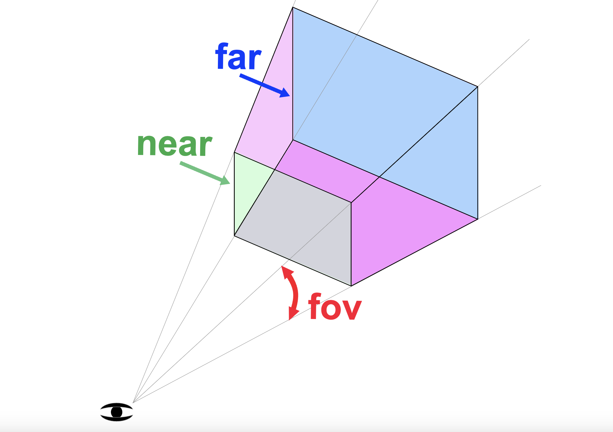

本篇文章仅仅创建一个最基础的场景，使用 Vite 创建一个最简单的项目，引入 Three.js 依赖，借助其 API 渲染一个立方体。

源码文件：[01.basic-scene](https://github.com/supuwoerc/threejs-roadmap/blob/main/01.basic-scene/src/main.ts)

## 源码示例

第一节的内容十分简单，不过多展开，直接在代码中添加了一些注释来解释：

```typescript
import * as THREE from "three";
const sizes = {
  width: 800,
  height: 600,
};
// 创建一个场景
const scene = new THREE.Scene();
// 创建几何形状
const geometry = new THREE.BoxGeometry(1, 1, 1);
// 创建材质
const material = new THREE.MeshBasicMaterial({ color: 0xff0000 });
// 组合geometry和material
const mesh = new THREE.Mesh(geometry, material);
// 添加到场景中
scene.add(mesh);
// 创建一个相机
const camera = new THREE.PerspectiveCamera(75, sizes.width / sizes.height);
// 添加到场景
scene.add(camera);
// 创建渲染器
const renderer = new THREE.WebGLRenderer({
  canvas: document.querySelector(".webgl") as HTMLCanvasElement,
});
// 设置渲染画布大小
renderer.setSize(sizes.width, sizes.height);
// 移动相机(threejs使用的是右手坐标系)
camera.position.z = 5;
// 渲染
renderer.render(scene, camera);
```
下面介绍一些基础的概念：
* mesh（网格）= geometry（几何形状） + material（材质）

* 渲染结果 = render(scene + camera)

在 Three.js 中，`PerspectiveCamera`（透视相机）是一种用于创建透视投影的相机类型。该相机模拟了人眼看世界的方式，根据视点、视角和近远裁剪平面来定义可见的场景。

PerspectiveCamera 的构造函数具有以下参数：

* fov（Field of View）：视角，fov 参数表示相机视场的垂直角度，以度数为单位。较小的 fov 值会产生一个放大的效果，使场景中的对象看起来更大。较大的 fov 值会产生一个缩小的效果，使场景中的对象看起来更小。通常，推荐使用 45 到 60 度之间的值。

* aspect：宽高比，aspect 参数表示渲染区域的宽度与高度之比。它的值应该与渲染器的宽高比保持一致，以防止场景被拉伸或压缩。一般情况下，可以使用渲染器的宽度除以高度来获取宽高比。

* near：近裁剪面，near 参数表示相机能够看到的最近距离。位于 near 之前的场景中的对象将不可见。较小的 near 值会使场景中的对象看起来更大，但太小的值可能会导致 Z 轴深度精度问题。

*  far：远裁剪面，far 参数表示相机能够看到的最远距离。位于 far 之后的场景中的对象将不可见。较大的 far 值可扩展相机的视野，但太大的值可能会导致 Z 轴深度精度问题。

下面这张图是`PerspectiveCamera`相关参数的含义示意：



使用 `PerspectiveCamera`，可以通过调整这些参数来控制相机的视野范围、透视效果和可见场景的深度范围。

