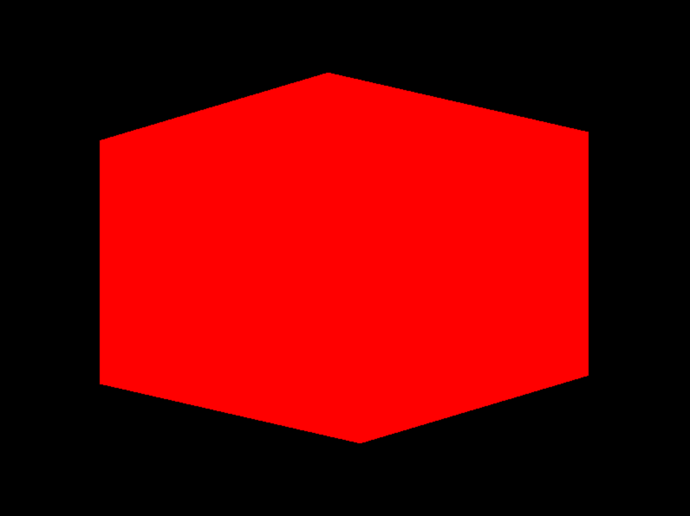
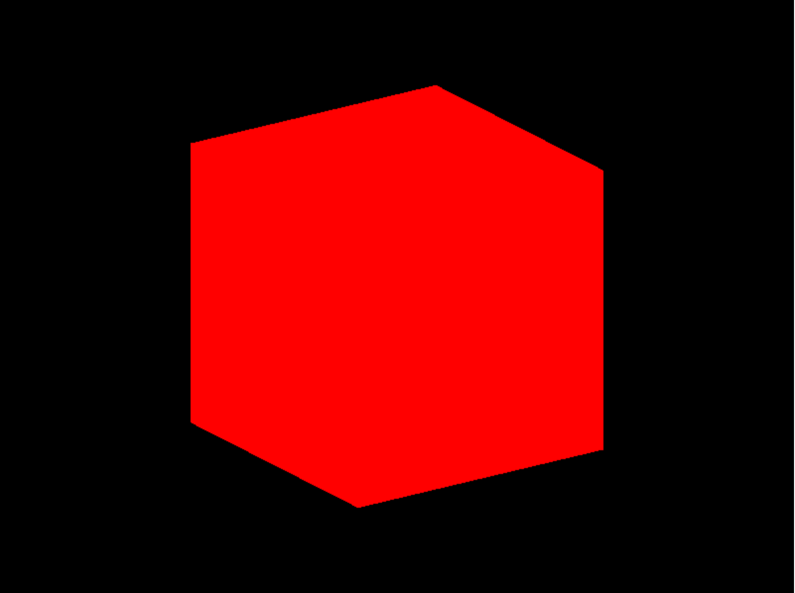

本篇文章基于上篇文章[03.动画](/docs/learn-threejs/animations)，介绍Threejs中的动画。

源码文件：[04.cameras](https://github.com/supuwoerc/threejs-roadmap/blob/main/04.cameras/src/main.ts)

## 常用的相机

在 Three.js 中，Camera（相机）用于定义观察场景的视角和范围。

主要有两种常见的相机类型：

* PerspectiveCamera（透视相机）： 模拟人眼观察世界的方式，具有近大远小的透视效果。
    * 构造函数通常接受 fov（视野角度）、aspect（宽高比）、near（近裁剪面距离）和 far（远裁剪面距离）等参数来定义其特性。
* OrthographicCamera（正交相机）： 无论物体距离相机的远近，其大小都保持不变，常用于 2D 风格或需要精确尺寸控制的场景。
    * 构造函数通常接受 left（左裁剪面）、right（右裁剪面）、top（上裁剪面）、bottom（下裁剪面）、near 和 far 等参数。

通过设置相机的位置、朝向（使用 lookAt 方法）以及调整相机的参数，可以控制场景在屏幕上的呈现效果。 相机在 Three.js 中起着至关重要的作用，决定了用户能够看到的场景内容和视角。

## Z-Fighting

PerspectiveCamera 的构造方法签名：constructor(fov?: number, aspect?: number, near?: number, far?: number);其中参数的含义在前文做了解释，这里介绍错误的设置near（近裁剪面距离）和 far（远裁剪面距离）
引发的 Z-Fighting 问题。

在 Three.js 中，当将 PerspectiveCamera 的 near 值设置为一个极小值（如 0.0000001），far 值设置为一个极大值（如 99999999）时，可能会引发 Z-Fighting（深度冲突）问题。

Z-Fighting 是指在渲染过程中，由于深度缓冲区的精度限制，两个或多个物体在深度上非常接近，导致它们在渲染时出现闪烁、交错或不正确的遮挡关系。

当 near 和 far 值的范围过大时，深度缓冲区中用于表示深度的有限精度被过度拉伸，使得在相近深度的物体的深度值难以准确区分，从而引发 Z-Fighting 。

为了避免 Z-Fighting ，应该根据场景的实际大小和需求，合理设置 near 和 far 值，通常保持它们之间的比例相对较小，以获得更好的深度精度和稳定的渲染效果。

下面的示例中，立方体不能完整的展示在相机视角内，原因就是远裁剪面距离小于立方体到相机的距离：
```typescript
const camera = new THREE.PerspectiveCamera(
  75,
  sizes.width / sizes.height,
  1,
  5.7  // 此处的5.7 < 5.744562646538029(相机和立方体的距离)
);
// 移动相机(threejs使用的是右手坐标系)
camera.position.x = 2;
camera.position.y = 2;
camera.position.z = 5;
console.log(mesh.position.distanceTo(camera.position)); // 5.744562646538029
```

## PerspectiveCamera

这一摄像机不过多介绍，整个教程会大量使用它，相关的细节可以参考官方文档：[PerspectiveCamera](https://threejs.org/docs/?q=Persp#api/zh/cameras/PerspectiveCamera)。

## OrthographicCamera

在这种投影模式下，无论物体距离相机距离远或者近，在最终渲染的图片中物体的大小都保持不变，正是由于这种特性，一般用于渲染2D场景或者UI元素。

### 构造方法

方法签名：OrthographicCamera( left : Number, right : Number, top : Number, bottom : Number, near : Number, far : Number )

* left：摄像机视锥体左侧面。
* right：摄像机视锥体右侧面。
* top：摄像机视锥体上侧面。
* bottom：摄像机视锥体下侧面。
* near：摄像机视锥体近端面。
* far：摄像机视锥体远端面。

使用 OrthographicCamera 替换 PerspectiveCamera
```typescript
// const camera = new THREE.PerspectiveCamera(
//   75,
//   sizes.width / sizes.height,
//   1,
//   5.7  // 此处的5.7 < 5.744562646538029(相机和立方体的距离)
// );
const camera = new THREE.OrthographicCamera(-1, 1, 1, -1, 0.1, 100);
```
渲染结果是这样的：



很容易发现，渲染结果似乎不是一个立方体，而是一个长方体，实际上，这是因为我们的画布尺寸和相机的视角尺寸设置比例不一致导致的：

```typescript
// 画布是一个长方形
const sizes = {
  width: 800,
  height: 600,
};
// ......some code
// 相机裁剪面是一个正方形
const camera = new THREE.OrthographicCamera(-1, 1, 1, -1, 0.1, 100);
```
知道了渲染错误的原理之后，修复的方法也很简单：
* 可以修改画布尺寸，使得画布的宽高比和相机的裁剪面一样是个正方形
* 可以修改相机的裁剪面，使得相机裁剪面的宽高比和画布一致

```typescript
// 修改画布尺寸比例
const sizes = {
  width: 600,
  height: 600,
};
```

```typescript
// 修改相机裁剪面比例
const ratio = sizes.width / sizes.height;
const camera = new THREE.OrthographicCamera(-1 * ratio, 1 * ratio, 1, -1, 0.1, 100);
```

修复后的渲染结果是这样的：



## 控制相机

下面介绍如何将鼠标的交互映射到相机视角，分别通过原生事件和 Three.js 提供的能力。

### 原生实现

修改元素样式，使得body占满页面：
```css
html,
body {
  width: 100%;
  height: 100%;
}
```
将尺寸归一化，计算出相机的位置，需要注意的是，网页中的坐标系和 Three.js 的坐标系 Y 轴方向是相反的：
```typescript
// 画布占满页面
const sizes = {
  width: document.body.clientWidth,
  height: document.body.clientHeight,
};
// 其他代码... 此处省略
const cursor = {
  x: 0,
  y: 0,
};
window.addEventListener("mousemove", (e) => {
  cursor.x = e.clientX / sizes.width - 0.5;
  // 需要将 Y 方向的位置取反！！！
  cursor.y = -(e.clientY / sizes.height - 0.5);
});
const tick = () => {
  camera.position.x = cursor.x * 3;
  camera.position.y = cursor.y * 3;
  // 相机视角朝向立方体
  camera.lookAt(mesh.position)
  renderer.render(scene, camera);
  window.requestAnimationFrame(tick);
};
tick();
```
tick 方法里面，我们选择随意的将鼠标的位置归一化之后 *3，很容易发现，我们无法看到立方体的背面：

```typescript
const tick = () => {
  // 鼠标的横向移动-调整相机的x/z坐标，将相机的移动到物体的背面
  camera.position.x = Math.sin(cursor.x * Math.PI * 2) * 3;
  camera.position.z = Math.cos(cursor.x * Math.PI * 2) * 3;
  camera.position.y = cursor.y * 5;
  // 相机视角朝向立方体
  camera.lookAt(mesh.position);
  renderer.render(scene, camera);
  window.requestAnimationFrame(tick);
};
tick();
```
这仅仅是在 x 方向上的设置，如果需要兼容 y 方向，代码将十分复杂，好在 Three.js 内已经提供了封装好的工具来供开发者直接使用。

### Controls

在 Three.js 中，有多种类型的控件（controls）可用于与 3D 场景进行交互，以下是一些常见的类型：

* OrbitControls（轨道控制）： 允许用户通过鼠标操作来旋转相机，围绕一个中心点进行轨道运动，还可以进行缩放和平移。常用于展示 3D 模型或场景，提供直观的视角控制。

* FlyControls（飞行控制）： 模拟飞行的体验，用户可以通过键盘或鼠标控制相机在场景中自由移动。

* FirstPersonControls（第一人称控制）： 类似于在第一人称游戏中的控制方式，根据用户的输入来移动和改变相机方向。

* PointerLockControls（指针锁定控制）： 当鼠标指针被锁定在屏幕上时，提供更自由的相机控制，常用于沉浸式的 3D 体验。

* TrackballControls（轨迹球控制）： 通过鼠标拖动来旋转相机，操作方式类似于操作一个虚拟的轨迹球。

这些控件各有特点，可以根据具体的应用场景和用户交互需求选择合适的控件来增强用户与 3D 场景的互动性和体验。

官方文档：[Controls](https://threejs.org/docs/?q=controls#api/zh/extras/Controls)

下面我们使用 OrbitControls 来代替原生实现对相机的控制：

```typescript
// 创建控制器
const controls = new OrbitControls(camera, renderer.domElement);
const tick = () => {
  window.requestAnimationFrame(tick);
  // 相机视角朝向立方体
  camera.lookAt(mesh.position);
  // 当 controls.enableDamping 或者 controls.autoRotate 设置为 true 时候必须调用 controls.update
  // controls.update();
  renderer.render(scene, camera);
};
tick();
```
为了使得更加贴近真实的旋转，我们可以开启阻尼并且设置系数，让旋转具备惯性：
```typescript
// 创建控制器
const controls = new OrbitControls(camera, renderer.domElement);
controls.enableDamping = true;
controls.dampingFactor = 0.01;
const tick = () => {
  window.requestAnimationFrame(tick);
  // 相机视角朝向立方体
  camera.lookAt(mesh.position);
  // 当 controls.enableDamping 或者 controls.autoRotate 设置为 true 时候必须调用 controls.update
  controls.update();
  renderer.render(scene, camera);
};
controls.update();
tick();
```
这时候再去旋转视角，发现视角已经具备了惯性，需要注意的是 controls.update 需要在帧重绘时主动调用，让控制器继续修改相机位置参数。

> 在 OrbitControls 中，controls.update() 方法的主要作用是根据用户的输入（如鼠标移动、滚轮滚动等）来更新相机的位置和姿态。
> 其原理是通过监听与用户交互相关的事件（如鼠标事件、触摸事件等）获取输入信息。然后，根据这些输入信息计算相机应该进行的旋转、缩放和平移的变化量。
> 具体来说，它会根据鼠标的拖动方向和距离计算相机绕目标点的旋转角度，根据滚轮的滚动计算相机的缩放比例，以及根据特定的按键或操作判断是否进行平移。
> 最后，将计算得到的变化应用到相机上，从而实现用户对 3D 场景视角的动态控制。
> 这个方法通常需要在每一帧的渲染循环中被调用，以确保相机的状态能够实时响应用户的操作，提供流畅的交互体验。