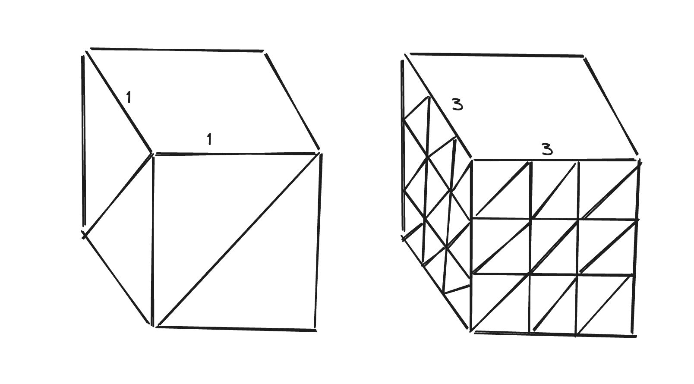
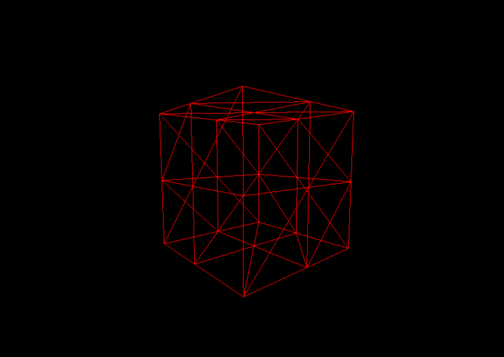
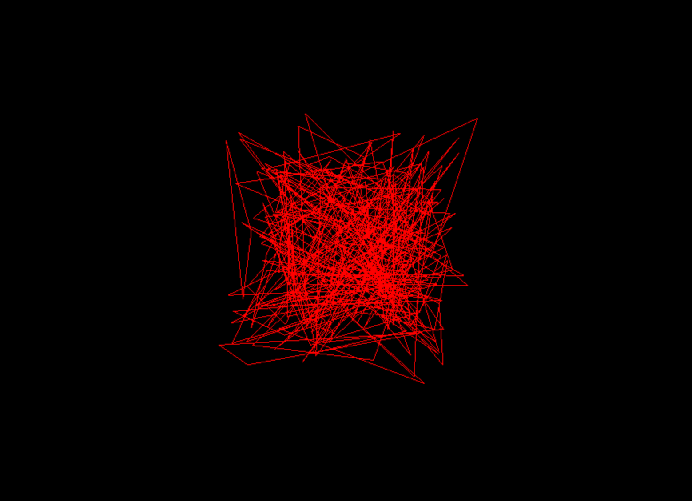

本篇文章基于上篇文章[05.全屏 & 调整大小](/docs/learn-threejs/resize)，介绍Threejs中几何形状相关的概念。

源码文件：[06.geometries](https://github.com/supuwoerc/threejs-roadmap/blob/main/06.geometries/src/main.ts)

## 介绍

Three.js 中的几何体（geometries）通常由以下几个主要组成部分构成：

* 顶点（Vertices）：几何体的顶点位置信息，通常以三维坐标表示。

* 面（Faces）：由顶点连接而成的多边形面，定义了几何体的表面。

* 法向量（Normal Vectors）：用于光照计算，决定每个面的朝向，以确定光线如何与之交互。

* UV 坐标（UV Coordinates）：用于纹理映射，指定纹理在几何体表面的分布。

* 顶点颜色（Vertex Colors）：可以为每个顶点指定颜色，实现更灵活的颜色效果。

* 索引（Indices）：用于优化渲染，减少重复顶点的存储和传输。


## Segments

这里以 BoxGeometry 来介绍 Segments 的概念，BoxGeometry 的构造方法如下：

```typescript
export class BoxGeometry extends BufferGeometry {
    constructor(
        // ... other props
        widthSegments?: number,
        heightSegments?: number,
        depthSegments?: number,
    );
    // ... other props and methods
}
```
* widthSegments：表示在几何体的宽度方向上的细分段数。

* heightSegments：表示在几何体的高度方向上的细分段数。

* depthSegments：表示在几何体的深度方向上的细分段数。

用图像表示就是这样：



很明显，segments 越大，界面上的细分三角形越多，渲染出来的几何形状面数量越多，能渲染出更真实的形状细节，但是同时也意味着更多的顶点需要计算，开发者需要考虑合理的优化。

我们还可以开启 material 的 wireframe 来查看几何线框：

```typescript
// 创建几何形状
const geometry = new THREE.BoxGeometry(1, 1, 1, 2, 2, 2);
// 创建材质
const material = new THREE.MeshBasicMaterial({
    color: 0xff0000,
    wireframe: true,
});
// 组合geometry和material
const mesh = new THREE.Mesh(geometry, material);
```
渲染结果如下：



## 自定义几何形状

这部分我们会创建一个自定义的几何形状，了解一个几何形状最基本的构成，以及一些原生 javascript 的数组概念。

在 Three.js 中创建自定义的几何体（geometries），通常需要以下几个步骤：

* 创建 BufferGeometry 对象。

* 使用 Float32Array 来定义顶点位置、法向量、颜色等属性数据。

* 通过 BufferAttribute 将数据设置到几何体的属性上。

通常使用 Float32Array 存储这些高精度的浮点数数据，目的是准确的表示顶点坐标、颜色值等信息。

### Float32Array

Float32Array 是 JavaScript 中的一种类型化数组（Typed Array）。

它专门用于存储 32 位单精度浮点数。与普通的 JavaScript 数组相比，Float32Array 在内存使用和操作性能上更具优势，特别是在处理大量数值数据时。

它的一些主要特点和用法：

* 内存效率：由于每个元素的大小固定为 32 位（4 字节），可以更精确地控制内存使用，避免了普通数组中可能存在的元素类型不一致导致的内存浪费。

* 性能优化：在进行数值计算和数据传输时，因为数据类型统一，能提高操作速度。

更多关于 Float32Array 的介绍可以查看 [MDN上的文档](https://developer.mozilla.org/zh-CN/docs/Web/JavaScript/Reference/Global_Objects/Float32Array) 。

借助 Float32Array 我们可以存储顶点的位置信息，这是顶点信息中最基本的信息。顶点的位置信息包含 3 个位置坐标：x、y 和 z，但是由于 Float32Array 是一个一维数组，所以我们需要依次存入三个坐标信息。

```typescript
const positions = new Float32Array([0, 0, 0, 0, 1, 0, 1, 0, 0]);
```

### BufferAttribute

在 Three.js 中，BufferAttribute 用于将数据关联到几何体的属性上。 BufferAttribute 可以有效地处理大量的顶点数据，例如顶点位置、颜色、法向量、UV 坐标等。 

它需要传入一个 Float32Array 或其他类型的数组，并指定每个元素的步长（itemSize）。

在之前创建 positions 来描述顶点信息的时候我们需要制定 itemSize 为 3，如果是其他类型的数据，我们需要修改这个参数来正确划分数据，例如 UV 需要为 2，size 需要为 1。

### BufferGeometry

BufferGeometry 是一种用于定义和管理几何体数据的方式， 它以类型化数组（如 Float32Array ）的形式存储几何体的顶点位置、法向量、颜色、UV 坐标、索引等数据。

BufferGeometry 的主要优点包括高效的内存使用和更快的渲染性能，特别是在处理大型或复杂的几何体时。

通过 BufferGeometry ，您可以更精确地控制几何体的数据，并能够动态地修改这些数据以实现各种效果，例如动画或几何体的变形。

下面的示例代码描述了如何创建自定义几何形状的步骤：
```typescript
// 自定义几何-1.定义顶点信息
const positions = new Float32Array([0, 0, 0, 0, 1, 0, 1, 0, 0]);
// 自定义几何-2.定义顶点位置attr
const positionsAttr = new THREE.BufferAttribute(positions, 3);
// 自定义几何-3.创建BufferGeometry
const geometry = new THREE.BufferGeometry();
// 自定义几何-4.将顶点位置attr设置到几何的顶点属性上
geometry.setAttribute("position", positionsAttr);
```
渲染的结果是这样的：


因为 3 个点就可以确定面，所以我们也可以随机的创建非常多的三角形来描述几何形状：

```typescript
// 定义需要count个三角形来描述
const count = 100;
// 创建数组来存储顶点位置坐标
const positions = new Float32Array(count * 3 * 3);
// 随机设置顶点位置
for (let index = 0; index < positions.length; index++) {
  positions[index] = (Math.random() - 0.5) * 2;
}
// 创建顶点的位置attr
const positionAttr = new THREE.BufferAttribute(positions, 3);
// 创建几何
const geometry = new THREE.BufferGeometry();
// 设置顶点信息到几何上
geometry.setAttribute("position", positionAttr);
```
渲染的结果每一次都不一样，大致的效果是这样的：


以上就是如何创建自定义几何形状的简单介绍。
