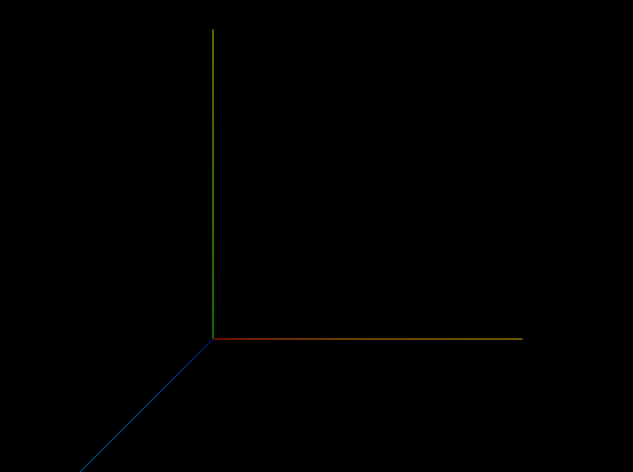

本篇文章基于上篇文章[01.基础场景](docs/learn-threejs/basic-scene)，介绍如何对场景中的对象进行移动/缩放/旋转。

源码文件：[02.transform-objects](https://github.com/supuwoerc/threejs-roadmap/blob/main/02.transform-objects/src/main.ts)

## 移动

这部分主要介绍如何移动一个对象，借助 position ，我们可以移动一个物体。

### position属性

在 Three.js 中，position 属性用于设置物体在 3D 空间中的位置，继承自Object3D的对象都存在position属性，这是一个三维向量，
它包含了 x、y 和 z 三个分量，分别表示在三个坐标轴上的位置，默认值 Vector3(0,0,0) 。

例如我想要设置场景中的立方体元素的位置，设置 position 通常有两种方法：

第一种就是直接设置分量的值：
```typescript
// 方法1
mesh.position.x = 2;
mesh.position.y = 1;
mesh.position.z = 1;
```
第二种是借助 Vector3 的 set 方法，也是分别设置三个分量的值：
```typescript
// 方法2
mesh.position.set(2, 1, 1);
```
#### length
length 是 Vector3 的一个常用的方法，用于计算从(0, 0, 0) 到 (x, y, z)的欧几里得长度 （即直线长度）。

官方文档：[Vector3.length](https://threejs.org/docs/index.html?q=Vector3#api/zh/math/Vector3.length)

```typescript
// 输出对象到坐标原点的距离
console.log(mesh.position.length());
```

#### distanceTo

distanceTo 也是 Vector3 的一个常用的方法，它计算向量到另外一个 Vector3 的距离，也就是说 length 实际上就相当于 v1.distanceTo((new THREE.Vector3(0, 0, 0))。

在计算物体之间的距离、判断物体是否在一定范围内等场景中 distanceTo 非常有用。

官方文档：[Vector3.distanceTo](https://threejs.org/docs/index.html?q=Vector3#api/zh/math/Vector3.distanceTo)

```typescript
mesh.position.set(2, 1, 1);
// 输出对象到坐标原点的距离
console.log(mesh.position.length());
console.log(mesh.position.distanceTo(new THREE.Vector3(0, 0, 0)));
// 归一化
mesh.position.normalize();
// 再次输出对象到坐标原点的距离
console.log(mesh.position.length());
console.log(mesh.position.distanceTo(new THREE.Vector3(0, 0, 0)));
```

#### normalize

在 Three.js 中，THREE.Vector3 的 normalize() 方法用于将向量归一化。 归一化就是把向量的长度变为 1，同时保持其方向不变。

例如，如果有一个向量 v ，其坐标为 (x, y, z) ，并且其长度为 L = sqrt(x^2 + y^2 + z^2) ，那么调用 v.normalize() 后，v 的坐标将变为 (x/L, y/L, z/L) 。

官方文档：[Vector3.normalize](https://threejs.org/docs/index.html?q=Vector3#api/zh/math/Vector3.normalize)

```typescript
// 归一化
mesh.position.normalize();
// 再次输出对象到坐标原点的距离
console.log(mesh.position.length()); // 1
```

## AxesHelper

用于简单模拟3个坐标轴的对象. 红色代表 X 轴. 绿色代表 Y 轴. 蓝色代表 Z 轴.

```typescript
// 为了方便看到axesHelper，移除mesh
scene.remove(mesh)
// 为了方便看到axesHelper,调整相机位置
camera.position.set(1, 1, 3);
scene.add(camera);
// 获取两个对象的距离
console.log(mesh.position.distanceTo(camera.position));
// 创建轴线辅助器，指定size
const axesHelper = new THREE.AxesHelper(3);
scene.add(axesHelper);
```
渲染结果是这样的：


## 缩放

这部分介绍如何对一个对象进行缩放，Three.js中的 Mesh 继承了 Object3D，所以 mesh 实例可以直接设置相关属性，调用相关的方法。

```typescript
export class Mesh<
    TGeometry extends BufferGeometry = BufferGeometry,
    TMaterial extends Material | Material[] = Material | Material[],
    TEventMap extends Object3DEventMap = Object3DEventMap,
> extends Object3D<TEventMap>{}
```

### scale属性

scale 是一个对象的局部缩放向量，默认值是一个 Vector3(0,0,0)。

官方文档：[Object3D.scale](https://threejs.org/docs/index.html?q=mesh#api/zh/core/Object3D.scale)

既然是一个 Vector3 向量，所以设置它也和 position 一样有两种方法，直接设置和调用 set 方法。

直接修改三个方向的分量：

```typescript
mesh.scale.x = 2;
mesh.scale.y = 0.5;
```
调用 set 方法设置分量：

```typescript
mesh.scale.set(2, 0.5, 1);
```

## 旋转

这部分介绍如何对一个对象进行旋转，同时介绍旋转中涉及到的一些概念。

在 Three.js 中，旋转是改变物体方向的重要操作，主要有以下两种常见的方式：

* `rotate` ：通过 rotateX() 、 rotateY() 、 rotateZ() 方法分别绕 X 轴、Y 轴、Z 轴旋转。或者直接调整 rotation 属性（Euler）来设置。
* `quaternion` ：四元数是一种用于表示旋转的数学结构，在 Three.js 中使用 `Quaternion` 类来表示。四元数的优点在于可以避免万向锁问题，并且在进行多次旋转组合时能提供更稳定和准确的结果

> 万向锁（Gimbal Lock）是在使用欧拉角（Euler Angles）来表示旋转时可能出现的一种现象。
> 在三维空间中，使用欧拉角通常通过三个角度（例如绕 X 轴、Y 轴、Z 轴的旋转角度）来描述物体的旋转。然而，当其中一个轴旋转到特定角度时，会导致另外两个轴的旋转自由度减少，出现旋转限制或不确定性的情况。
> 具体来说，当 Y 轴旋转使得 Z 轴和 X 轴重合时，就会发生万向锁（XYZ顺序下的旋转，X旋转会导致Y和Z的旋转，Y旋转会导致Z旋转，Z旋转不会引起Z和Y的旋转）。此时，仅通过这两个轴的旋转组合无法表示某些旋转状态，导致旋转的自由度从三个减少到两个，可能会引起不期望的旋转行为或动画异常。
> 为了避免万向锁问题，在一些对旋转精度和稳定性要求较高的场景，如 3D 图形和动画、航空航天模拟等领域，常使用四元数（Quaternions）或矩阵来表示旋转，Three.js 中也提供了相应的方法和机制来处理旋转，以尽量避免万向锁带来的影响。

<div style="text-align: center; margin-top: 1em;">
<iframe src="//player.bilibili.com/player.html?isOutside=true&aid=771397545&bvid=BV1Nr4y1j7kn&cid=788925183&p=1" scrolling="no" border="0" frameborder="no" framespacing="0" allowfullscreen="true" width="100%" height="400"></iframe>
</div>

### rotation

rotation 是一个 Euler 对象，Euler 来描述对象的旋转需要定义旋转的顺序，例如 XYZ 就是按照 X轴，y轴，z轴的顺序去旋转，不同的旋转顺序会导致最终的结果不一致。

```typescript
// 下面的几行代码的顺序调整不会影响最终结果，因为旋转顺序已经被定义，和执行代码的顺序无关
mesh.rotation.x = Math.PI / 2;
mesh.rotation.y = Math.PI / 2;
mesh.rotation.z = Math.PI / 2;
```

```typescript
// 下面的代码顺序会影响最终的结果，因为代码指定的顺序就是 Euler 变换的顺序
mesh.rotateX(Math.PI / 2)
mesh.rotateY(Math.PI / 2)
mesh.rotateZ(Math.PI / 2)
```

既然是 Euler 对象，那么也就可以直接调用 Euler 自带的一些方法，下面举例两个：

官方文档：[Euler](https://threejs.org/docs/index.html?q=Euler#api/zh/math/Euler)


#### reorder

在 Three.js 中，Euler 的 reorder() 方法用于重新排列欧拉角的顺序。

欧拉角通常有多种顺序表示，比如 XYZ、YXZ、ZXY 等。reorder() 方法接受一个表示新顺序的字符串参数。

例如，如果当前欧拉角的顺序是 XYZ，您可以使用 reorder('ZYX') 将其更改为 ZYX 顺序。

#### set

在 Three.js 中，Euler 的 set() 方法用于设置欧拉角的值。

set() 方法通常接受三个参数，分别对应绕 X 轴、Y 轴和 Z 轴的旋转角度（以弧度为单位）。它还有第四个参数，用于定义旋转顺序。

```typescript
mesh.rotation.set(Math.PI / 2, Math.PI / 2, Math.PI / 2, "XYZ");
```

### quaternion

在 Three.js 中，Quaternion（四元数）是用于表示三维旋转的一种数学结构。

四元数由一个实部和三个虚部组成，可以紧凑且高效地表示旋转，并且在进行旋转操作的组合、插值等方面具有一些优势，能够避免使用欧拉角时可能出现的万向锁问题。

Quaternion 对象通常通过以下方式创建和操作：

* 创建：可以使用 new THREE.Quaternion(x, y, z, w) 来创建一个新的四元数，其中 x、y、z 是虚部的分量，w 是实部。

* 旋转设置：可以通过各种方法来设置表示特定旋转的四元数，例如从欧拉角转换、从轴角表示转换等。

* 组合：可以对多个四元数进行乘法操作来组合它们表示的旋转。

* 应用于物体：使用 Object3D.setRotationFromQuaternion(quaternion) 方法将四元数应用于 3D 物体以设置其旋转。

```typescript
mesh.setRotationFromQuaternion(new THREE.Quaternion(0.2, 0.2, 0.2, 1));
```

## lookAt

Object3D 对象上定义了一个方法：lookAt，这个方法会自动处理对象的旋转，将元素朝向目标位置。

lookAt() 方法通常用于相机（THREE.Camera）或物体（THREE.Object3D），以使其朝向指定的目标点。

对于相机，lookAt() 方法会调整相机的方向，使其朝向给定的目标位置。这对于确定相机的观察方向非常有用，从而决定了场景中哪些部分将被渲染到屏幕上。

```typescript
camera.lookAt(mesh.position);
```

官方文档：[Object3D.lookAt](https://threejs.org/docs/index.html?q=Object#api/zh/core/Object3D.lookAt)

## Group

Group 是一个用于组合多个 3D 对象的容器对象，继承自 Object3D 。

Group 本身不具有任何特定的几何形状或外观，但它可以将多个子对象组织在一起，方便进行统一的操作，例如整体移动、旋转、缩放或应用材质等。

通过将多个相关的 3D 对象添加到一个 Group 中，可以将它们视为一个逻辑单元进行处理，简化了场景的管理和操作。

例如，如果您有几个相互关联的模型或几何体需要一起进行变换、控制可见性或与其他对象进行交互，就可以将它们添加到一个 Group 中，然后对这个组进行操作，而无需分别处理每个子对象。
创建和使用 Group 的一般步骤如下：

```typescript
// 创建组
const group = new THREE.Group();
const box = new THREE.Mesh(
    new THREE.BoxGeometry(1, 1, 1),
    new THREE.MeshBasicMaterial({ color: "blue" })
);
const box2 = box.clone();
box2.material = new THREE.MeshBasicMaterial({ color: "green" });
box2.position.x = 2;
group.add(mesh, box, box2);
// 将整个 group 整体缩放
group.scale.set(1.2, 1.2, 1.2);
scene.add(group);
```
借助 Group 我们可以快速的批量处理多个元素，同时在场景中划分出合理的模块，减少维护的复杂度。